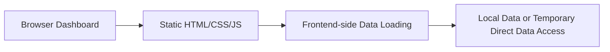
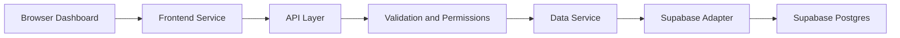
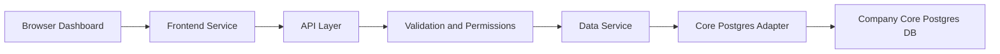

# Security-First Architecture

## Purpose

This document explains how this dashboard repository should safely evolve from a static frontend into a secure application that can later use either Supabase or the company core Postgres database.

The goal is to keep the architecture:

- secure
- easy to understand
- easy to review
- easy to migrate later

## Current State

Today this repository is a static dashboard project.

What exists today:

- Static HTML pages such as `index.html` and `finance-adjustments.html`
- Shared styling in `styles.css`
- A small client-side page registry in `dashboard-pages.js`
- Frontend-side data loading logic inside the dashboard page

Important note:

- The current frontend-side data loading should be treated as a temporary development shape, not the final secure architecture.
- The long-term goal is to move data access behind a controlled API/service layer.

## Target Secure Architecture

The recommended secure shape is:

`Frontend -> frontend service -> API layer -> validation/permissions -> data service -> adapter -> database`

This means the browser should not know how to query the database directly for privileged operations. Instead, the browser should ask a controlled server-side layer for only the data it needs.

## Why The Frontend Must Not Use Privileged Database Credentials

Anything in browser code is public.

That means:

- HTML is public
- CSS is public
- browser JavaScript is public
- network requests from the browser can be inspected

If a privileged database credential is placed in browser code, anyone who loads the page could potentially extract it and misuse it.

That is why:

- privileged keys must stay server-side only
- database permissions should be enforced before data reaches the browser
- the frontend should request dashboard data, not raw table access

## Recommended Layers

### 1. Frontend

This is the dashboard UI the user sees in the browser.

What it should do:

- render charts, tables, cards, and filters
- request dashboard data from a safe interface
- stay focused on presentation and interaction

What it should not do:

- store privileged credentials
- run privileged database queries
- depend directly on raw database table structures

Why it exists:

- to present data clearly to the user

### 2. Frontend Service

This is a thin frontend helper layer that hides fetch details from UI components.

What it should do:

- call safe API endpoints
- handle request formatting
- handle response parsing
- return stable dashboard data to the UI

What it should not do:

- contain secrets
- contain business-critical permission rules
- talk directly to privileged database services

Why it exists:

- to keep UI code simple and reusable

### 3. API Layer

This is the server-side entry point for dashboard requests.

What it should do:

- receive requests from the frontend
- route requests to the right service
- return only the intended response shape

What it should not do:

- expose raw internal database details directly to the browser
- trust the browser without checks

Why it exists:

- to create a safe boundary between the browser and backend systems

### 4. Validation And Permissions Layer

This layer checks whether a request is valid and allowed.

What it should do:

- validate inputs
- enforce access rules
- reject malformed or unauthorised requests

What it should not do:

- assume browser input is safe
- skip authorization because the UI looks internal

Why it exists:

- to prevent accidental overexposure of data

### 5. Data Service

This layer contains application-side data logic.

What it should do:

- request the correct data for the dashboard
- combine, filter, or shape data for the adapter layer
- keep business logic out of the UI

What it should not do:

- hardwire the frontend to one specific database vendor

Why it exists:

- to keep backend logic understandable and maintainable

### 6. Adapter Layer

This layer translates between the application and a specific backend.

What it should do:

- know how to talk to Supabase today
- later know how to talk to core Postgres
- return data in a stable internal format

What it should not do:

- leak vendor-specific details into UI components

Why it exists:

- to make backend migration possible without rewriting the frontend

### 7. Database

This is the data source.

Today it may later be:

- Supabase Postgres

Later it may become:

- company core Postgres

The important rule is that the rest of the application should not need major rewrites when the database source changes.

## How Supabase Fits In

Supabase can be used as one possible backend implementation.

In the secure target architecture:

- the frontend does not use any privileged Supabase key
- the API/service layer talks to a Supabase adapter
- the adapter handles Supabase-specific details
- the rest of the application keeps vendor-neutral naming and stable data contracts

That means Supabase is treated as an implementation detail, not as the dashboard architecture itself.

## How Core Postgres Can Replace Supabase Later

If the company later moves to core Postgres, the ideal change is:

- keep the frontend mostly unchanged
- keep the API shape mostly unchanged
- keep the dashboard data contracts mostly unchanged
- replace the Supabase adapter with a core Postgres adapter

This is why the adapter and data-contract boundaries matter so much.

## Mermaid Diagrams

### Current State

### Target Secure State

### Later Core Postgres State

## Example Request Flow

Example: load finance adjustments dashboard data

1. The browser opens the finance adjustments page.
2. The UI calls a frontend service such as `getFinanceAdjustments()`.
3. The frontend service sends a request to a safe API endpoint such as `/api/finance-adjustments`.
4. The API layer receives the request.
5. The validation/permissions layer checks that the request shape is valid and the caller is allowed to access the data.
6. The data service asks the active adapter for the finance adjustments dataset.
7. The adapter talks to the configured backend.
8. The backend returns raw rows.
9. The application maps those rows into a stable dashboard contract.
10. The API returns the safe contract to the frontend.
11. The UI renders charts and tables using that contract.

## Recommended Direction For This Repo

As this repository evolves, the safest approach is:

- keep the frontend focused on display
- move data access behind a server-side boundary
- keep vendor-neutral naming
- use stable contracts between backend and UI
- treat Supabase as replaceable

That gives you a path from today’s static dashboard to a more secure architecture without forcing a full rewrite later.
