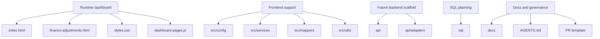
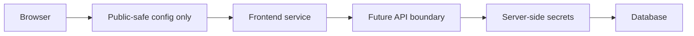
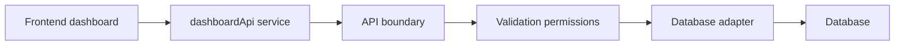
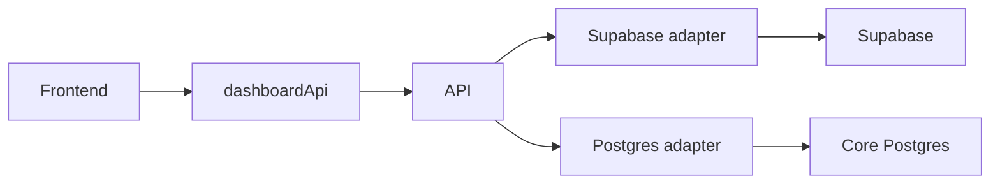

# Presentation Outline

## 1. Current State Of The Dashboard

- Key message:
  - This repository currently runs a static dashboard with shared styling and page-level JavaScript.
- Talking points:
  - The live runtime is still HTML, CSS, and browser JavaScript.
  - There are currently two runtime pages: home and finance adjustments.
  - The repo also contains newer support layers and documentation for safer backend integration later.
- Suggested visual:
  - Simple repo tree highlighting `index.html`, `finance-adjustments.html`, `styles.css`, and `dashboard-pages.js`.
- Likely stakeholder questions:
  - Is this already connected to a real backend?
  - Which parts are currently live versus only planned?

## 2. Why We Introduced Structure

- Key message:
  - We introduced structure to reduce risk before adding a real backend connection.
- Talking points:
  - Without structure, data access tends to spread across HTML pages.
  - That makes review, maintenance, and security harder.
  - The new structure introduces clear homes for config, services, mapping, backend scaffolding, and SQL planning.
- Suggested visual:
  - Before/after diagram of data logic scattered in pages versus centralized support layers.
- Likely stakeholder questions:
  - Why not keep it simple and connect directly?
  - Is this overengineering for a static dashboard?

## 3. Repo Structure Overview

- Key message:
  - The repo is organized into runtime files, frontend support layers, backend scaffolding, SQL planning, and documentation.
- Talking points:
  - Runtime dashboard files still live at the root.
  - Shared frontend support now lives under `src/`.
  - Future backend and SQL work has an intentional home.
  - Documentation supports onboarding and safer review.
- Suggested visual:
  - Tree diagram.

- Likely stakeholder questions:
  - Which folders affect runtime today?
  - Which folders are placeholders?

## 4. What Is Runtime Versus Scaffold

- Key message:
  - Not everything in the repo is active runtime code yet.
- Talking points:
  - Runtime: home page, finance page, shared CSS, page registry, shared frontend config/service/mapper/http helper, and mock data.
  - Scaffold: `api/`, `api/adapters/`, `sql/`, and several README files.
  - Documentation exists to prevent people from mistaking scaffold for a finished backend.
- Suggested visual:
  - Two-column slide: “Used now” and “Prepared for later”.
- Likely stakeholder questions:
  - How much of the architecture is real today?
  - Are we presenting future intent as current implementation?

## 5. Security-First Design

- Key message:
  - The repo is being prepared so secrets and privileged database logic do not end up in browser files.
- Talking points:
  - Browser code is public and inspectable.
  - Secrets must never be committed or shipped to the frontend.
  - Public-safe config and server-side secrets must be separated clearly.
  - Small reviewable changes reduce security mistakes.
- Suggested visual:
  - Security boundary diagram.

- Likely stakeholder questions:
  - What is actually secure today?
  - What still depends on discipline and review?

## 6. Service, API, And Adapter Pattern

- Key message:
  - We want the frontend to call a stable dashboard service, not a vendor-specific database directly.
- Talking points:
  - Pages should call the frontend service layer.
  - The frontend service should call an API boundary.
  - The API should handle validation, permissions, and adapter calls.
  - Adapters should contain database-specific logic.
- Suggested visual:
  - Layered flow diagram.

- Likely stakeholder questions:
  - Why add an adapter if Supabase already has APIs?
  - What does the mapper layer do?

## 7. Supabase Now, Core Postgres Later

- Key message:
  - The architecture is designed so the frontend can survive a backend swap later.
- Talking points:
  - Today’s likely first backend is Supabase.
  - Later the company may move to a core Postgres database.
  - The adapter pattern allows the backend source to change without rewriting the UI.
- Suggested visual:
  - Side-by-side future-state diagram.

- Likely stakeholder questions:
  - Are we locking ourselves into Supabase?
  - How expensive would a migration be later?

## 8. GitHub Workflow And Review Controls

- Key message:
  - Security is also about process, not only code.
- Talking points:
  - Work should happen in focused branches.
  - Diffs should be reviewed locally and in PRs.
  - The PR template includes security checks.
  - AGENTS.md adds explicit repository rules for safe changes.
- Suggested visual:
  - Simple branch to PR to merge workflow diagram.
- Likely stakeholder questions:
  - What stops unsafe code from being merged?
  - How do we review AI-assisted changes safely?

## 9. What Has Been Implemented So Far

- Key message:
  - The first real server-side API boundary and adapter are now live.
- Talking points:
  - Shared frontend config, service, mapper, and HTTP helper are all in place.
  - A Supabase Edge Function (`finance-adjustments`, version 2) is deployed and active.
  - The Edge Function is the first real server-side API boundary: it queries the database, maps raw column names to the stable contract, and returns only the fields the UI needs.
  - The `service_role` key lives only inside the Edge Function runtime and never reaches the browser.
  - The finance dashboard now loads all 6,775 live rows from Supabase in production mode.
  - Documentation and review controls are in place.
- Suggested visual:
  - Checklist slide with “implemented now”.
- Likely stakeholder questions:
  - Is the finance page connected to real Supabase data?
  - Where does the privileged key live?

## 10. What Has Not Been Implemented Yet

- Key message:
  - Authentication, access control, and remaining datasets are still to be built.
- Talking points:
  - The Edge Function has no authentication yet — auth is the next milestone.
  - RLS policies currently allow public reads on the raw tables and should be tightened once auth is in place.
  - CORS is currently open to all origins and should be locked to the deployed domain.
  - Edge Functions for other datasets (support tickets, research, dashboard summary) are not yet built.
  - No live SQL migrations or automated database deployment workflow yet.
  - No production-ready external secret manager yet (relevant for the future AWS migration).
- Suggested visual:
  - “Not yet live” checklist.
- Likely stakeholder questions:
  - Is the data protected if someone discovers the Edge Function URL?
  - What needs to happen before production use with sensitive internal data?

## 11. Next Safe Implementation Steps

- Key message:
  - The next steps should keep scope small and reviewable.
- Talking points:
  - Add authentication to the Edge Function (Supabase Auth + `verify_jwt: true`).
  - Tighten RLS policies so raw tables are not directly readable with the anon key.
  - Lock CORS to the specific deployed domain.
  - Review and remove `sessionStorage` caching if the data is considered sensitive.
  - Extend the Edge Function pattern to remaining datasets one at a time.
  - Keep using stable data contracts and mapper functions throughout.
- Suggested visual:
  - Three-step roadmap.
- Likely stakeholder questions:
  - What would you implement next?
  - What is the biggest current risk?

## Closing Message

- Key message:
  - The repository is being prepared carefully so that backend integration can happen later without compromising security or forcing a full UI rewrite.
- Talking points:
  - Current dashboard still works.
  - Security model is becoming clearer.
  - Repo structure now supports safer future growth.
- Suggested visual:
  - One-slide summary of runtime, scaffold, and future path.
