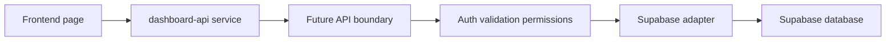
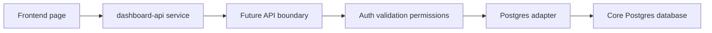

# Repo Structure Guide

## Purpose Of This Repository

This repository currently hosts a static dashboard experience with shared styling and page-level JavaScript. It is also being prepared for a safer future architecture where the frontend does not talk directly to privileged database credentials.

Today, the repo does two jobs at once:

- It runs the current dashboard pages.
- It carries scaffold and documentation for a more secure service and backend integration model.

## Current Structure

```text
product-dashboard-plyr/
├── Runtime dashboard
│   ├── index.html
│   ├── finance-adjustments.html
│   ├── styles.css
│   └── dashboard-pages.js
├── Frontend support layers
│   └── src/
│       ├── config/
│       ├── services/
│       ├── mappers/
│       └── utils/
├── Future backend scaffolding
│   ├── api/
│   └── sql/
├── Documentation
│   ├── AGENTS.md
│   ├── docs/
│   └── .github/pull_request_template.md
└── Repo safety/config
    ├── .gitignore
    └── .env.example
```

## Tree With Real Files

```text
product-dashboard-plyr/
├── .env.example
├── .github/
│   └── pull_request_template.md
├── .gitignore
├── AGENTS.md
├── api/
│   ├── README.md
│   └── adapters/
│       └── README.md
├── dashboard-pages.js
├── docs/
│   ├── architecture.md
│   ├── code-explanation-guide.md
│   ├── data-contracts.md
│   ├── development-workflow.md
│   ├── implementation-status.md
│   ├── presentation-outline.md
│   ├── repo-inventory.md
│   ├── repo-structure-guide.md
│   ├── security-model.md
│   ├── security-presentation-notes.md
│   └── supabase-connection-model.md
├── finance-adjustments.html
├── index.html
├── sql/
│   ├── README.md
│   └── templates/
│       └── dashboard_read_model_template.sql
├── src/
│   ├── config/
│   │   ├── README.md
│   │   └── public-config.js
│   ├── mappers/
│   │   ├── README.md
│   │   └── dashboard.mapper.js
│   ├── services/
│   │   ├── README.md
│   │   ├── dashboard-api.browser.js
│   │   ├── dashboard-api.js
│   │   └── mock-data/
│   │       └── dashboard.mock.js
│   └── utils/
│       └── http.js
└── styles.css
```

## What Each Area Is For

### Runtime dashboard files

- `index.html`
  - Home page for the dashboard suite.
  - Should contain page markup and page-level runtime logic only.
- `finance-adjustments.html`
  - Current live dashboard page for finance adjustments.
  - Should remain focused on UI behavior, not backend credentials or raw database access.
- `styles.css`
  - Shared visual language for the dashboard family.
  - Should contain styling, not data logic or secrets.
- `dashboard-pages.js`
  - Shared navigation metadata and sidebar rendering helpers.
  - Should define page registry and shell-level metadata, not backend logic.

### `src/` frontend support layers

This folder exists to stop data access from being scattered directly across HTML files.

#### `src/config/`

- What belongs here:
  - Public-safe frontend configuration only.
  - Non-secret values like environment label and API base path.
- What should not belong here:
  - Service role keys
  - Database passwords
  - Internal-only URLs that should stay server-side

#### `src/services/`

- What belongs here:
  - Frontend service functions that know which API paths the dashboard calls.
  - Mock data support for safe local development while backend work is not live.
- What should not belong here:
  - Raw Supabase client initialization with privileged keys
  - Business logic spread across many pages
  - Server-only code

#### `src/mappers/`

- What belongs here:
  - Normalizers that turn API-shaped or backend-shaped records into stable UI contracts.
- What should not belong here:
  - Page rendering code
  - Direct database querying
  - Secrets

#### `src/utils/`

- What belongs here:
  - Small shared browser-safe helpers like HTTP wrappers.
- What should not belong here:
  - App-specific business logic
  - Hidden auth or credentials

### `api/` future backend boundary

- What belongs here:
  - Future secure backend entry points.
  - Validation, auth checks, permission checks, adapter calls.
- What should not belong here:
  - Frontend-only rendering logic
  - Browser-only helpers
  - Committed secrets

### `api/adapters/` future database adapters

- What belongs here:
  - Source-specific logic for Supabase today and core Postgres later.
- What should not belong here:
  - UI logic
  - Page rendering
  - Public browser config

### `sql/` reviewed database artifacts

- What belongs here:
  - Draft SQL views
  - RLS notes
  - Migration planning files
- What should not belong here:
  - Live credentials
  - Automatically executed production scripts unless the repo is intentionally upgraded for that later

### `docs/` project explanation and operating guides

- What belongs here:
  - Architecture, security, workflow, and presentation-ready documentation.
- What should not belong here:
  - Runtime-only logic
  - Secrets or environment values that look real

## Why This Structure Was Chosen

This structure was chosen to improve three things without forcing a full rewrite:

- Maintainability
  - Data access is starting to move out of individual HTML pages and into shared modules.
- Security
  - Public frontend config is separated from future server-side-only config and adapter logic.
- Portability
  - The frontend can target a stable dashboard contract while the backend source changes later.

## How This Supports Maintainability

- Shared styles remain in one file.
- Shared page metadata lives in one runtime registry file.
- Shared data loading is moving into `src/services/`.
- Mapping logic is separated from UI logic.
- Future database-specific work has an obvious home instead of being added ad hoc.

## How This Supports Security

- It creates a clear place for public-safe config and a separate place for future server-only logic.
- It discourages secrets from being added to HTML files.
- It makes privileged backend work easier to isolate behind an API boundary.
- It creates reviewable checkpoints through docs, pull request templates, and repo conventions.

## How This Supports Future Supabase Integration

The current intended flow is:



- The frontend should only know the service layer and stable dashboard contracts.
- Supabase-specific query logic should stay behind the API boundary and adapter.

## How This Supports Future Migration To Core Postgres



- The page does not need to know whether data came from Supabase or the company core Postgres DB.
- The API and adapter layer absorb the backend swap.
- Mappers and contracts reduce UI breakage during migration.

## Where The Current Static Dashboard Still Lives

The current running dashboard still lives in:

- `index.html`
- `finance-adjustments.html`
- `styles.css`
- `dashboard-pages.js`

In other words, the repo is still fundamentally a static dashboard repo today.

## Which Folders Are Future-Facing Scaffolding

These are primarily future-facing:

- `api/`
- `api/adapters/`
- `sql/`
- `src/config/README.md`
- `src/services/README.md`
- `src/mappers/README.md`

These are partly scaffolded and partly already active in runtime:

- `src/config/public-config.js`
- `src/services/dashboard-api.js`
- `src/services/dashboard-api.browser.js`
- `src/services/mock-data/dashboard.mock.js`
- `src/mappers/dashboard.mapper.js`
- `src/utils/http.js`

## Practical Summary

This repo structure is intentionally transitional:

- The dashboard still runs as static HTML/CSS/JS.
- The service, mapper, and config layers are starting to reduce unsafe coupling.
- The backend, adapter, and SQL areas are present as planned homes for future secure integration work.
