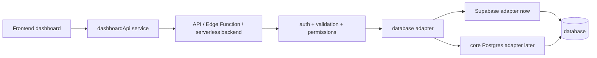

# Supabase Connection Model

## Purpose

This document explains how the dashboard should connect to Supabase safely without exposing privileged access in browser code.

The short version is:

- the browser should call a safe dashboard service
- the dashboard service should call an API boundary
- the API boundary should call a database adapter
- the adapter should talk to Supabase today
- the adapter can later be replaced by core Postgres

## Secure Connection Model

The recommended path is:

`Frontend dashboard -> dashboardApi service -> API / Edge Function / serverless backend -> auth + validation + permissions -> database adapter -> Supabase adapter now OR core Postgres adapter later -> database`

This keeps the frontend simple and keeps privileged access out of the browser.

## Why The Browser Should Not Use Privileged Keys

Browser code is public.

Users can inspect:

- HTML
- CSS
- JavaScript
- network requests

That means privileged keys must never be placed in frontend code.

If a secret key is shipped to the browser, it is no longer secret.

## When Anon/Public Keys Are Acceptable

Public or anon keys are only acceptable when all of the following are true:

- they are intentionally designed for browser use
- Row Level Security is enabled
- access is least-privilege
- the browser only gets data it is allowed to see
- broad raw-table access is avoided

Even then, public keys should be treated carefully and reviewed as part of the security model.

## Why Secret Or `service_role` Keys Are Server-Side Only

Secret keys are powerful.

Examples:

- `SUPABASE_SECRET_KEY`
- `SUPABASE_SERVICE_ROLE_KEY`

These belong server-side only because they may allow:

- elevated reads
- writes
- admin operations
- bypassing normal client restrictions

Safe places for these secrets later include:

- server-side hosting provider environment variables
- Supabase Edge Functions
- Vercel serverless functions
- Netlify functions
- Cloudflare Workers
- a future internal backend

They do not belong in static frontend files.

## How RLS Fits In

RLS is part of the safety model when using browser-safe access.

RLS helps by:

- limiting which rows can be read
- limiting which rows can be written
- reducing overexposure risk

But RLS is not a reason to skip the API boundary for privileged or sensitive operations.

Good rule:

- use RLS for safe client access
- use the API boundary for controlled application access

## How This Supports Future Migration

If the frontend talks to:

- a dashboard service
- stable data contracts
- a secure API boundary

then the backend can change more safely later.

That means:

- Supabase can be used behind an adapter now
- core Postgres can replace it later
- frontend pages do not need to learn database-specific query details

This is the main migration benefit of the adapter model.

## Diagram

## Recommended Rule For This Repo

As this repo evolves:

- frontend code should call shared dashboard services
- shared dashboard services should call internal API-style endpoints
- adapters should isolate database-specific details
- privileged keys should stay server-side only

That keeps the dashboard secure, easier to review, and easier to migrate later.
