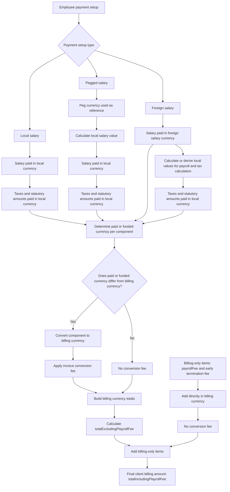

# Currency Conversion Fee Rules

## Overview

This document explains when conversion fees apply when moving from an employee's salary/payment setup to the final client billing amount.

The key rule is:
> A conversion fee applies when an amount Playroll pays or funds in one currency needs to be converted into a different currency to be billed to the client.

Conversion fees are not applied simply because an employee has a foreign salary, salary peg, or multiple currencies in the data. They apply only when there is an actual conversion required between the amount's paid/funded currency and the client billing currency.

---

## Core Currency Definitions

| Term                    | Meaning                                                                                                                           |
| ----------------------- | --------------------------------------------------------------------------------------------------------------------------------- |
| Local currency          | The currency of the employee's employment territory.                                                                              |
| Foreign salary currency | The currency the employee is actually paid in, where the employee is set up as foreign-paid.                                      |
| Peg currency            | The reference currency used to calculate a local salary value for pegged employees.                                               |
| Billing currency        | The currency used to invoice the client.                                                                                          |
| Conversion fee          | Fee applied when an amount paid or funded by Playroll in one currency must be converted into another currency for client billing. |

---

## Core Rule

| Rule                                                                             | Explanation                                                                                                                                  |
| -------------------------------------------------------------------------------- | -------------------------------------------------------------------------------------------------------------------------------------------- |
| Conversion fee applies when paid/funded currency differs from billing currency.  | If Playroll pays or funds an amount in one currency and bills the client in another, a conversion fee applies.                               |
| Conversion fee does not apply when paid/funded currency equals billing currency. | No billing conversion is required for that amount.                                                                                           |
| Conversion fee does not apply to peg valuation.                                  | Pegging is used to calculate a local salary value; it is not the billing conversion.                                                         |
| Conversion fee does not apply to foreign-to-local payroll preparation.           | Foreign amounts may need to be converted to local currency for local payroll/tax calculation, but that is not the client billing conversion. |
| Conversion fee does not apply to billing-only items.                             | Billing-only items such as Playroll fees and early termination fees are added in the billing currency.                                       |

---

## High-Level Process

| Step | Description |
|---|---|
| 1 | Identify the employee payment setup: local, pegged, or foreign salary. |
| 2 | Determine the paid/funded currency for each component. |
| 3 | Use local currency where payroll/tax calculations or statutory payments are required. |
| 4 | Compare each component's paid/funded currency against the client billing currency. |
| 5 | Apply a conversion fee only where the paid/funded currency differs from the billing currency. |
| 6 | Build the billing currency totals. |
| 7 | Add billing-only items such as `payrollFee` and early termination fees directly in billing currency. |
| 8 | Produce the final client billing amount. |

---

## Mermaid Flow

---

## Local Currency Employees

For local currency employees, the employee is paid in the local currency. Taxes and statutory amounts are also paid in the local currency

| Component                  | Paid/Funded Currency |
| -------------------------- | -------------------- |
| Salary / payroll payment   | Local currency       |
| Taxes / statutory payments | Local currency       |
| Employer contributions     | Local currency       |
| Employee contributions     | Local currency       |
| Playroll fee               | Billing currency     |
| Early termination fee      | Billing currency     |

---

## Foreign Salary Employees

For a foreign salary employee, the employee's salary is actually paid in the foreign salary currency. Taxes and statutory amounts are paid to the local authorities in the local currency. This means salary and taxes can have different paid/funded currencies.

| Component | Paid/Funded Currency |
|---|---|
| Salary / payroll payment | Foreign salary currency |
| Taxes / statutory payments | Local currency |
| Employer contributions | Local currency |
| Employee contributions | Local currency |
| Playroll fee | Billing currency |
| Early termination fee | Billing currency |

---

## Foreign Salary Flow

| Step | Description                                                                                                      |
| ---- | ---------------------------------------------------------------------------------------------------------------- |
| 1    | Employee salary starts in the foreign salary currency.                                                           |
| 2    | Local values are calculated or derived so payroll/tax calculations can happen for the employee territory.        |
| 3    | Salary is paid in the foreign salary currency.                                                                   |
| 4    | Taxes and statutory amounts are paid in the local currency.                                                      |
| 5    | Each paid/funded component is compared against the client billing currency.                                      |
| 6    | Components that differ from billing currency are converted into billing currency and receive the conversion fee. |
| 7    | Components already in billing currency do not receive the conversion fee.                                        |

---
## Pegged Salary Employees

For pegged employees, the peg currency is a reference currency only. The employee is still paid in local currency. The peg is used to calculate or adjust the local salary value before payroll calculation.

| Component | Paid/Funded Currency |
|---|---|
| Salary / payroll payment | Local currency |
| Taxes / statutory payments | Local currency |
| Employer contributions | Local currency |
| Employee contributions | Local currency |
| Playroll fee | Billing currency |
| Early termination fee | Billing currency |

---
## Pegged Salary Flow

| Step | Description |
|---|---|
| 1 | Employee salary is linked to a peg/reference currency. |
| 2 | Peg value is converted or used to calculate a local salary value. |
| 3 | Employee is paid in local currency. |
| 4 | Taxes and statutory amounts are paid in local currency. |
| 5 | Local paid/funded components are compared against the client billing currency. |
| 6 | If billing currency differs from local currency, those components are converted to billing currency and receive the conversion fee. |
| 7 | If billing currency matches local currency, no conversion fee applies. |

---

## Billing-Only Items

Some items are billing-only items.
They are charged to the client directly in the billing currency.

| Billing-Only Item | Conversion Fee? | Notes |
|---|---:|---|
| Playroll fee | No | Added directly in billing currency. |
| Early termination fee | No | Added directly in billing currency. |

Billing-only items may appear in other currency objects for representation, but this does not mean they are paid or funded in those currencies. They are not used by the client in those other currencies.

---

## How This Maps to Totals

The totals breakdown may show values in several currency objects.

| Object | Purpose |
|---|---|
| `totalsLocalCurrency` | Shows local currency payroll/tax calculation values. |
| `totalsSalaryPaymentCurrency` | Shows salary payment currency values where applicable. |
| `totalsBillingCurrency` | Shows client billing currency values. |

The conversion fee affects billing currency values only where the underlying paid/funded component had to be converted into the billing currency.

---

## Total Excluding Playroll Fee

`totalExcludingPlayrollFee` is built from invoice-bearing components after they have been represented in billing currency.

| Component Type | Included? | Conversion Fee Treatment |
|---|---:|---|
| Salary/payment amounts | Yes | Fee applies if paid currency differs from billing currency. |
| Employer taxes/contributions | Yes | Fee applies if local currency differs from billing currency. |
| Expenses/direct expenses | Yes, where applicable | Fee applies if paid/funded currency differs from billing currency. |
| Leave/termination payout amounts | Yes, where applicable | Fee applies if paid/funded currency differs from billing currency. |
| Employee contributions | No, generally not invoice-bearing | May be converted for representation. |
| Payroll fee | No | Added after. |
| Early termination fee | No, if treated as billing-only | Added in billing currency. |

---

## Total Including Playroll Fee

`totalIncludingPlayrollFee` is the final client billing amount.

It is calculated from:

| Component | Treatment |
|---|---|
| `totalExcludingPlayrollFee` | Includes invoice-bearing converted components. |
| `payrollFee` | Added in billing currency, no conversion fee. |
| Billing-only early termination fee | Added in billing currency, no conversion fee, if applicable. |

---

## Final Business Rule

A conversion fee applies only when an amount Playroll actually pays or funds in one currency needs to be billed to the client in another currency.

| Amount Type | Rule |
|---|---|
| Local salary/payment amount | Fee applies if local currency differs from billing currency. |
| Foreign salary/payment amount | Fee applies if foreign salary currency differs from billing currency. |
| Peg reference amount | No fee; it is only used to calculate the local salary value. |
| Local taxes/statutory amounts | Fee applies if local currency differs from billing currency. |
| Employer contributions | Fee applies if local currency differs from billing currency. |
| Employee contributions | Converted for representation if local currency differs from billing currency. |
| Playroll fee | No fee; billing-only item. |
| Early termination fee | No fee; billing-only item. |

---

## One-Line Rule

> Conversion fee follows the currency Playroll pays or funds, compared against the currency Playroll bills the client in.
