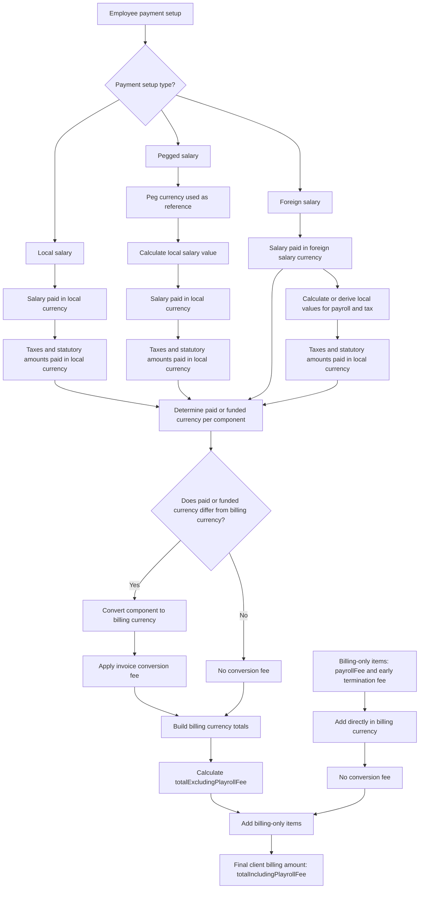

# Currency Conversion Fees

## Overview

A currency conversion fee applies when Playroll pays or funds an amount in one currency and bills the client in a different currency. The fee does not apply simply because an employee has a foreign salary, salary peg, or multiple currencies in the data — it applies only when there is an actual conversion required between the currency in which the amount was paid or funded and the client billing currency.

## Product Context

Playroll incurs a real cost when converting currencies to settle payroll and fund client invoices. The conversion fee covers this cost and is embedded in the billing currency invoice total rather than listed as a separate charge. Because payroll for a single employee can involve multiple currencies — local payroll, foreign salary payment, and client billing — the fee logic must be applied at the component level, not the whole invoice level. Operations teams and clients need to understand which components carry the fee and which do not, particularly for employees with foreign salary or salary peg arrangements.

## Core Currency Definitions

| Term | Meaning |
|---|---|
| Local currency | The currency of the employee's employment territory. |
| Foreign salary currency | The currency the employee is actually paid in, where the employee is set up as foreign-paid. |
| Peg currency | The reference currency used to calculate a local salary value for pegged employees. |
| Billing currency | The currency used to invoice the client. |
| Conversion fee | Fee applied when an amount paid or funded by Playroll in one currency must be converted into another currency for client billing. |

## Core Rule

| Rule | Explanation |
|---|---|
| Conversion fee applies when paid or funded currency differs from billing currency. | If Playroll pays or funds an amount in one currency and bills the client in another, a conversion fee applies. |
| Conversion fee does not apply when paid or funded currency equals billing currency. | No billing conversion is required for that amount. |
| Conversion fee does not apply to peg valuation. | Pegging calculates a local salary value — it is not the billing conversion. |
| Conversion fee does not apply to foreign-to-local payroll preparation. | Converting a foreign salary to local currency for tax purposes is not the client billing conversion. |
| Conversion fee does not apply to billing-only items. | Billing-only items such as the Playroll fee and early termination fee are added directly in the billing currency. |

## High-Level Process

| Step | Description |
|---|---|
| 1 | Identify the employee payment setup: local, pegged, or foreign salary. |
| 2 | Determine the paid or funded currency for each component. |
| 3 | Use local currency where payroll, tax calculations, or statutory payments are required. |
| 4 | Compare each component's paid or funded currency against the client billing currency. |
| 5 | Apply a conversion fee only where the paid or funded currency differs from the billing currency. |
| 6 | Build the billing currency totals. |
| 7 | Add billing-only items such as the Playroll fee and early termination fees directly in billing currency. |
| 8 | Produce the final client billing amount. |

## Diagram

## Local Currency Employees

For local currency employees, the employee is paid in the local currency. Taxes and statutory amounts are also paid in the local currency.

| Component | Paid or Funded Currency |
|---|---|
| Salary and payroll payment | Local currency |
| Taxes and statutory payments | Local currency |
| Employer contributions | Local currency |
| Employee contributions | Local currency |
| Playroll fee | Billing currency |
| Early termination fee | Billing currency |

## Foreign Salary Employees

For a foreign salary employee, the salary is paid in the foreign salary currency. Taxes and statutory amounts are paid in the local currency. Salary and taxes can therefore have different paid or funded currencies.

| Component | Paid or Funded Currency |
|---|---|
| Salary and payroll payment | Foreign salary currency |
| Taxes and statutory payments | Local currency |
| Employer contributions | Local currency |
| Employee contributions | Local currency |
| Playroll fee | Billing currency |
| Early termination fee | Billing currency |

### Foreign Salary Flow

| Step | Description |
|---|---|
| 1 | Employee salary starts in the foreign salary currency. |
| 2 | Local values are calculated or derived so payroll and tax calculations can happen for the employee territory. |
| 3 | Salary is paid in the foreign salary currency. |
| 4 | Taxes and statutory amounts are paid in the local currency. |
| 5 | Each paid or funded component is compared against the client billing currency. |
| 6 | Components that differ from the billing currency are converted into billing currency and receive the conversion fee. |
| 7 | Components already in billing currency do not receive the conversion fee. |

## Pegged Salary Employees

For pegged employees, the peg currency is a reference only. The employee is still paid in local currency. The peg is used to calculate or adjust the local salary value before payroll calculation.

| Component | Paid or Funded Currency |
|---|---|
| Salary and payroll payment | Local currency |
| Taxes and statutory payments | Local currency |
| Employer contributions | Local currency |
| Employee contributions | Local currency |
| Playroll fee | Billing currency |
| Early termination fee | Billing currency |

### Pegged Salary Flow

| Step | Description |
|---|---|
| 1 | Employee salary is linked to a peg or reference currency. |
| 2 | Peg value is converted or used to calculate a local salary value. |
| 3 | Employee is paid in local currency. |
| 4 | Taxes and statutory amounts are paid in local currency. |
| 5 | Local paid or funded components are compared against the client billing currency. |
| 6 | If the billing currency differs from local currency, those components are converted and receive the conversion fee. |
| 7 | If the billing currency matches local currency, no conversion fee applies. |

## Billing-Only Items

Some items are charged to the client directly in the billing currency. They are not paid or funded by Playroll in a different currency and therefore carry no conversion fee.

| Billing-Only Item | Conversion Fee? | Notes |
|---|---:|---|
| Playroll fee | No | Added directly in billing currency. |
| Early termination fee | No | Added directly in billing currency. |

Billing-only items may appear in other currency objects for representation purposes, but they are not paid or funded in those currencies.

## How This Maps to Totals

| Object | Purpose |
|---|---|
| `totalsLocalCurrency` | Shows local currency payroll and tax calculation values. |
| `totalsSalaryPaymentCurrency` | Shows salary payment currency values where applicable. |
| `totalsBillingCurrency` | Shows client billing currency values. |

The conversion fee affects billing currency values only where the underlying paid or funded component had to be converted into the billing currency. The `totalsBillingCurrency.totalExcludingPlayrollFee` embeds the transaction fee. See [[transaction-fee-calculation]].

## Total Excluding Playroll Fee

`totalExcludingPlayrollFee` is built from invoice-bearing components after they have been represented in the billing currency.

| Component Type | Included? | Conversion Fee Treatment |
|---|---:|---|
| Salary and payment amounts | Yes | Fee applies if paid currency differs from billing currency. |
| Employer taxes and contributions | Yes | Fee applies if local currency differs from billing currency. |
| Expenses and direct expenses | Yes, where applicable | Fee applies if paid or funded currency differs from billing currency. |
| Leave and termination payout amounts | Yes, where applicable | Fee applies if paid or funded currency differs from billing currency. |
| Employee contributions | No — generally not invoice-bearing | May be converted for representation purposes. |
| Payroll fee | No | Added after `totalExcludingPlayrollFee`. |
| Early termination fee | No, if treated as billing-only | Added in billing currency. |

## Total Including Playroll Fee

`totalIncludingPlayrollFee` is the final client billing amount.

| Component | Treatment |
|---|---|
| `totalExcludingPlayrollFee` | Includes invoice-bearing converted components. |
| `payrollFee` | Added in billing currency — no conversion fee. |
| Early termination fee | Added in billing currency if treated as billing-only — no conversion fee. |

## Final Business Rule

| Amount Type | Rule |
|---|---|
| Local salary and payment amounts | Fee applies if local currency differs from billing currency. |
| Foreign salary and payment amounts | Fee applies if foreign salary currency differs from billing currency. |
| Peg reference amounts | No fee — used only to calculate the local salary value. |
| Local taxes and statutory amounts | Fee applies if local currency differs from billing currency. |
| Employer contributions | Fee applies if local currency differs from billing currency. |
| Employee contributions | Converted for representation if local currency differs from billing currency. |
| Playroll fee | No fee — billing-only item. |
| Early termination fee | No fee — billing-only item. |

## Exceptions and Edge Cases

| Scenario | Behaviour | Notes |
|---|---|---|
| Local currency equals billing currency | No conversion fee applies to any component. | All amounts are already in the billing currency. |
| Foreign salary currency equals billing currency | No conversion fee applies to the salary component. | The paid currency and billing currency match for that component. |
| Peg currency equals billing currency | No conversion fee applies — the peg is a reference only and the employee is paid in local currency. | The billing conversion is from local, not from the peg currency. |

## Data Notes

| Observation | Note |
|---|---|
| `invoiceConversionFeePercentage` in `exchangeRateContext` can be null. | When null, no conversion fee is configured for the employee's billing arrangement. |
| The conversion fee is embedded in `totalsBillingCurrency.totalExcludingPlayrollFee`. | It is not stored as a separate field. Use [[transaction-fee-calculation]] to derive it. |
| Billing-only items may appear in non-billing currency objects for representation. | Their presence in local or payment currency totals does not mean they are funded in those currencies. |

## Source Reference

| File Path | Purpose |
|---|---|
| `packages/calculator-service/src/helpers.ts` | Contains the currency conversion helpers that build billing currency totals and apply the conversion fee logic. |

> Conversion fee follows the currency Playroll pays or funds, compared against the currency Playroll bills the client in.

## Related Pages

| Page | Purpose |
|---|---|
| [[exchange-rates]] | Documents `invoiceConversionFeePercentage` and the exchange rate fields used in conversion. |
| [[totals-breakdown]] | Documents `totalExcludingPlayrollFee` and `totalIncludingPlayrollFee` in local and billing currency totals. |
| [[transaction-fee-calculation]] | Explains how to derive the embedded transaction fee from billing currency totals. |
| [[salary-payment-options]] | Explains local, foreign, and salary peg payment setups and their relationship to conversion fees. |
| [[termination-results]] | Documents early termination fee treatment as a billing-only item. |
| [[calculator-results]] | Parent record containing the salary totals and exchange rate context. |
