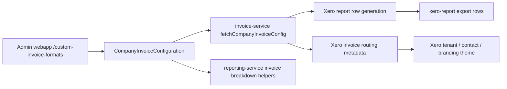

# Custom Invoice Format

## Overview

Custom invoice format is the company-level configuration that controls how invoice results are turned into client-facing invoice rows, especially in the Xero report export and the downstream Xero invoice flow. The configuration is managed in the admin webapp at `/custom-invoice-formats`, stored as `CompanyInvoiceConfiguration`, read by `invoice-service` and `reporting-service`, and then used to shape row grouping, row descriptions, invoice-number behavior, conversion-rate display, and Xero billing metadata.

**Search Tags:** `custom invoice format`, `custom invoice formats`, `CompanyInvoiceConfiguration`, `companyInvoiceConfiguration`, `xero report`, `xero-report`, `groupInvoiceNumbers`, `groupInvoiceNumberByStructure`, `rowLayout`, `lineGrouping`, `showConversionRate`, `hideNames`, `detailedAllowances`, `billingEntity`

## Product Context

The payroll calculator produces invoice-facing calculation results for each employee. Custom invoice format does not change the underlying payroll calculation itself. Instead, it changes how those results are packaged into invoice rows and invoice documents for the customer. In practice, this means:

- how many rows are created per employee
- how those rows are labeled
- whether employee names are shown
- whether allowance detail is expanded
- whether conversion-rate text is appended
- how invoice numbers are reused or split
- which Playroll billing entity and Xero tenant/contact/theme are used

This is why the feature sits between calculator output and Xero/report output, rather than inside the payroll calculation engine.

## Where It Is Configured

The admin entry point is the custom invoice formats page in the admin webapp:

- `/custom-invoice-formats`
- create flow: `admin-webapp/pages/custom-invoice-formats/create.tsx`
- edit flow: `admin-webapp/pages/custom-invoice-formats/edit/[id].tsx`
- shared form: `admin-webapp/src/components/custom-invoice-formats/form.tsx`

The admin API persists the configuration through:

- `admin-webapp/src/api/routes/custom-invoice-formats/*`
- `admin-webapp/src/api/dao/CustomInvoiceFormats.dao.ts`
- `admin-webapp/src/api/types/custom-invoice-formats.ts`

The stored record is the Prisma model `CompanyInvoiceConfiguration`.

## Admin Webapp Repo

The admin UI that operators use to set custom invoice formats lives in the workspace repo:

- `/Users/tristanr/Library/CloudStorage/OneDrive-VATitProcessing(Pty)Ltd/Desktop/Code Repos/playroll-core/admin-webapp`

The main files involved are:

| File | Purpose |
|---|---|
| `pages/custom-invoice-formats/index.tsx` | List page showing all configured custom invoice formats and linking to edit. |
| `pages/custom-invoice-formats/create.tsx` | Create page for adding a new company-level custom invoice format. |
| `pages/custom-invoice-formats/edit/[id].tsx` | Edit page for an existing company configuration. |
| `src/components/custom-invoice-formats/form.tsx` | Shared form component containing the actual fields, switches, selectors, and tooltips. |
| `src/api/routes/custom-invoice-formats/*` | API endpoints used by the UI. |
| `src/api/dao/CustomInvoiceFormats.dao.ts` | Prisma persistence layer for `CompanyInvoiceConfiguration`. |

## How Operators Set Custom Invoices

From a user or operator perspective, custom invoice formats are set in the admin webapp as follows:

1. Open `/custom-invoice-formats` in the admin webapp.
2. Review the list of companies that already have a saved custom invoice format.
3. Choose either:
   - create a new configuration for a company that does not yet have one
   - edit an existing configuration for a company that already has one
4. Select or confirm the target company.
5. Set the invoice-format fields such as row layout, invoice-number grouping, conversion-rate display, privacy settings, and billing entity.
6. Optionally select a Xero contact override and Xero branding theme override.
7. Save the configuration, which writes the `CompanyInvoiceConfiguration` record for that company.

### Create Flow

The create page is `admin-webapp/pages/custom-invoice-formats/create.tsx`.

It only offers companies that are:

- not already configured
- not archived
- named
- in `MSA_SIGNED` status

This means the admin UI is deliberately preventing duplicate custom invoice format records for the same company.

### Edit Flow

The edit page is `admin-webapp/pages/custom-invoice-formats/edit/[id].tsx`.

From the list page, operators click `Edit` for a company. The edit page then:

- fetches the existing saved `CompanyInvoiceConfiguration`
- hydrates the shared form with the current values
- saves changes back through the patch mutation

### Xero-Specific Selectors In The Form

The shared form also lets operators set:

- `Xero Contact (Optional)`
- `Xero Branding Theme (Optional)`

These selectors are populated dynamically based on the chosen `billingEntity`. When the billing entity changes, the form refetches:

- Xero contacts for that billing entity
- Xero branding themes for that billing entity

This is important because the billing entity drives the Xero tenant context, and the available contacts/themes depend on that tenant.

## Data Model

`CompanyInvoiceConfiguration` is a one-per-company configuration record.

| Field | Purpose |
|---|---|
| `lineGrouping` | Chooses whether Xero report rows are generated per company or per employee. |
| `rowLayout` | Chooses how employee salary components are split into rows. |
| `groupInvoiceNumberByStructure` | Chooses the invoice-number structure, such as one invoice per company, per employee, per territory, or per team. |
| `groupInvoiceNumbers` | Reuses the same invoice number for same-type row groups in certain flows. |
| `forceExcludeVat` | Legacy VAT override flag. Present in config, but the admin form warns it is no longer used in Xero report generation. |
| `hideNames` | Replaces employee names in row descriptions with external ID or employee ID. |
| `detailedAllowances` | Expands "Other Costs" descriptions into allowance-level detail where available. |
| `showConversionRate` | Appends conversion-rate text to salary-account rows and affects report conversion columns. |
| `conversionRateFormat` | Chooses whether conversion text is shown as billing-to-local or local-to-billing. |
| `billingEntity` | Selects the Playroll billing entity and therefore the Xero tenant/tax behavior. |
| `xeroBrandingThemeId` | Optional Xero branding theme override. |
| `xeroContactId` | Optional Xero contact override. |

### Enums

| Enum | Values |
|---|---|
| `CompanyInvoiceLineGrouping` | `COMPANY`, `EMPLOYEE` |
| `CompanyInvoiceStructure` | `PER_EMPLOYEE`, `PER_TEAM`, `PER_TEAM_BILLING_CONTACT`, `SINGLE_INVOICE_FOR_COMPANY`, `PER_TERRITORY_OF_EMPLOYMENT` |
| `CompanyInvoiceRowLayout` | `ISOLATE_SALARY_AND_ALLOWANCES`, `ISOLATE_ALL`, `ISOLATE_EXPENSES`, `SIMPLE` |
| `CompanyInvoiceBillingEntity` | `PLAYROLL_UK`, `PLAYROLL_SA`, `PLAYROLL_EUROPE` |
| `CompanyInvoiceConversionRateFormat` | `BILLING_TO_LOCAL`, `LOCAL_TO_BILLING` |

## End-To-End Flow

## Runtime Connection Points

| Layer | Main Connection |
|---|---|
| Admin webapp | Operators configure the company-specific format. |
| Prisma | Config is stored in `CompanyInvoiceConfiguration`. |
| `invoice-service` | Reads config and turns calculator results into Xero report rows. |
| `reporting-service` | Uses the same config for exchange/conversion columns in invoice breakdown reporting. |
| `xero` package | Uses billing entity, contact, and branding overrides when creating actual Xero invoices. |

## Defaults

If a company has no stored custom invoice format, `invoice-service` falls back to defaults.

There are therefore two different kinds of defaults to keep in mind:

- runtime fallback defaults used by services when no configuration record exists
- create-form starting values shown to operators in the admin webapp before the first save

These are related, but they are not the same thing.

### Default base config

| Field | Default |
|---|---|
| `lineGrouping` | `EMPLOYEE` |
| `rowLayout` | `SIMPLE` |
| `groupInvoiceNumberByStructure` | `SINGLE_INVOICE_FOR_COMPANY` |
| `groupInvoiceNumbers` | `false` |
| `forceExcludeVat` | `false` |
| `hideNames` | `false` |
| `detailedAllowances` | `false` |
| `showConversionRate` | `false` |
| `conversionRateFormat` | `BILLING_TO_LOCAL` |
| `billingEntity` | `null` |
| `xeroBrandingThemeId` | `null` |
| `xeroContactId` | `null` |

### Default child-company overrides

If the company has a parent, the service defaults become:

- `showConversionRate = true`
- `detailedAllowances = true`
- `billingEntity = PLAYROLL_UK`

This means child companies can inherit a more verbose invoice style even without an explicit saved configuration record.

### Admin Create Form Starting Values

When an operator opens the create page in the admin webapp, the form is initially pre-populated with these values:

| Field | Initial create-page value |
|---|---|
| `lineGrouping` | `COMPANY` |
| `rowLayout` | `ISOLATE_ALL` |
| `groupInvoiceNumberByStructure` | `SINGLE_INVOICE_FOR_COMPANY` |
| `groupInvoiceNumbers` | `false` |
| `forceExcludeVat` | `false` |
| `hideNames` | `false` |
| `detailedAllowances` | `false` |
| `showConversionRate` | `false` |
| `conversionRateFormat` | `BILLING_TO_LOCAL` |
| `billingEntity` | `PLAYROLL_UK` |

This means the create screen is opinionated about its initial values even before any config exists. That should not be confused with the runtime fallback used by `invoice-service` when no saved record is present.

## What Each Setting Changes

### `lineGrouping`

This is the top-level split between:

- `generateXeroReportPerCompany(...)`
- `generateXeroReportPerEmployee(...)`

In practice, this decides whether rows are assembled around company-level grouping or employee-level grouping. For employee-level grouping, row descriptions are explicitly employee-specific and amendments are attached back to each employee's section.

### `rowLayout`

This is the most visible formatting control because it changes which row types are emitted for each employee.

| `rowLayout` | Resulting behavior |
|---|---|
| `SIMPLE` | One combined salary row for `totalExcludingPlayrollFee`, plus separate Playroll fee row. |
| `ISOLATE_SALARY_AND_ALLOWANCES` | Base salary row, optional "Other Costs" row, and a separate "Taxes and Other Employment Costs" row. |
| `ISOLATE_ALL` | Breaks out base salary, bonus-like items, commission, expenses, other costs, overtime, back pay, discretionary, shift differential, contributions, forex fee where present, termination payout, leave payout, plus Playroll fee. |
| `ISOLATE_EXPENSES` | Splits expenses from the rest of salary/employment cost totals. |

The integration tests confirm that `ISOLATE_ALL` and `ISOLATE_SALARY_AND_ALLOWANCES` change which descriptions and row amounts appear in the Xero report.

### `groupInvoiceNumberByStructure`

This changes how invoice numbers are assigned across rows.

| Structure | Runtime behavior |
|---|---|
| `SINGLE_INVOICE_FOR_COMPANY` | Uses one invoice-number stream for the company. |
| `PER_EMPLOYEE` | Advances invoice numbers by employee. |
| `PER_TERRITORY_OF_EMPLOYMENT` | Reuses invoice numbers per employee country code. |
| `PER_TEAM` | Reuses invoice numbers per team and addresses the invoice to the team's billing contact where possible. |
| `PER_TEAM_BILLING_CONTACT` | Resolves a billing contact key and consolidates teams that share that billing contact. |

For `PER_TEAM` and `PER_TEAM_BILLING_CONTACT`, the billing-contact resolution also changes:

- the `Reference` suffix
- the invoice email target
- the invoice-number lookup key

### `groupInvoiceNumbers`

This setting is narrower than the structure setting. It controls whether the same invoice number is reused across row categories within a run.

In the employee Xero report flow:

- salary-like rows use a fixed salary invoice number
- `PLAYROLL_FEE` and `EARLY_TERMINATION_FEE` rows use a fixed fee invoice number

The admin form disables this toggle unless `groupInvoiceNumberByStructure = SINGLE_INVOICE_FOR_COMPANY`, which matches the fact that the behavior is easiest to reason about in the single-company invoice-number model.

### `hideNames`

This changes row descriptions that would normally contain employee names.

The service uses:

- external ID first, if present
- otherwise employee ID
- otherwise employee name when `hideNames = false`

This affects:

- employee salary rows
- other cost / contribution / fee descriptions
- amendment row descriptions

Example pattern:

- normal: `Jane Doe - December Salary`
- hidden with external ID: `EMP-001 - December Salary`
- hidden without external ID: `<employeeId> - December Salary`

### `detailedAllowances`

This affects the `OTHER_COSTS` description text.

When `false`, the row description uses:

- `Other Costs`

When `true`, the service attempts to build a breakdown via `getOtherCostsBreakdown(...)`, using:

- the employee's `otherAllowances`
- unworked-days apportionment multiplier where relevant
- salary-definition-to-salary-payment exchange context
- territory pay-period context

So this setting changes the labeling detail of the row, not the underlying allowance calculation.

### `showConversionRate` and `conversionRateFormat`

These settings affect both the Xero report row descriptions and the invoice breakdown reporting helpers.

In `invoice-service`, when `showConversionRate = true`:

- salary-account rows get conversion text appended to `*Description`
- the text is only added when exchange-rate data is available
- the displayed direction is controlled by `conversionRateFormat`

Examples:

- `BILLING_TO_LOCAL`: `1 USD = 18.2500 ZAR; Total ...`
- `LOCAL_TO_BILLING`: `1 ZAR = 0.0548 USD; Total ...`

In `reporting-service`, the same configuration controls whether reports show:

- `Exchange Rate` and `FX Transaction Fees`
- or just `Conversion Rate`

This means the setting is shared across both human-readable Xero row descriptions and more structured invoice breakdown reporting.

### `billingEntity`

This changes more than a label.

It determines:

- which Playroll billing entity is used
- which Xero tenant is selected
- which tax type is used in report rows
- which account code family is used in some Xero invoice flows

If `billingEntity` is null, helper logic defaults to `PLAYROLL_UK` and logs a warning.

### `xeroContactId` and `xeroBrandingThemeId`

These are Xero-specific overrides used by the Xero package when creating actual invoices.

If set:

- `xeroContactId` overrides contact lookup
- `xeroBrandingThemeId` overrides branding theme lookup

If not set, the system falls back to fetched defaults based on company/contact/billing-currency context.

### `forceExcludeVat`

This field still exists in the model and the admin UI, but the admin form explicitly warns:

- `Force Exclude VAT will no longer be used in the generation of the Xero report.`

In this investigation, I did not find active Xero report generation logic that reads `forceExcludeVat`. So for current documentation, it should be treated as a legacy or currently inactive flag unless another downstream path still consumes it outside the Xero report flow.

## How It Affects Xero Report Formatting

The main Xero report formatting path is in `invoice-service`.

The service:

1. fetches `CompanyInvoiceConfiguration`
2. chooses company-vs-employee grouping from `lineGrouping`
3. chooses row types from `rowLayout`
4. chooses invoice-number behavior from `groupInvoiceNumberByStructure` and `groupInvoiceNumbers`
5. builds row descriptions using `hideNames`, `detailedAllowances`, and `showConversionRate`
6. sets invoice header/footer fields such as `Reference`, `EmailAddress`, `BillingEntity`, `Currency`, and `*TaxType`

Important Xero report columns affected by custom invoice format include:

- `*InvoiceNumber`
- `Reference`
- `EmailAddress`
- `*Description`
- `*AccountCode`
- `*TaxType`
- `BillingEntity`
- `BrandingTheme` in some Xero invoice flows

## How It Connects to Actual Xero Invoices

The same configuration also affects the direct Xero invoice flow through `packages/xero`.

The Xero service:

- fetches `CompanyInvoiceConfiguration`
- chooses the connected Xero tenant from `billingEntity`
- resolves `xeroContactId` override or falls back to contact lookup
- resolves `xeroBrandingThemeId` override or falls back to branding-theme lookup
- maps the deposit invoice into a Xero `Invoice`

So the config has two related but different impacts:

| Output | Main effect |
|---|---|
| Xero report export | Row structure, descriptions, invoice numbering, tax/display metadata |
| Actual Xero invoice creation | Billing entity, tenant, contact, branding theme, tax behavior |

## Relationship to Calculator Results

Custom invoice format does not recalculate payroll totals. Instead, it formats the already-produced calculator results for invoicing.

The dependency chain is:

- calculator result provides salary totals, contribution totals, payout totals, and exchange-rate context
- custom invoice format decides how those values are split, labeled, grouped, and annotated for invoicing

This is why pages like [[calculator-results]], [[totals-breakdown]], [[exchange-rates]], and [[salary-payment-options]] are direct supporting references for understanding custom invoice format behavior.

## Known Implementation Notes

| Observation | Meaning |
|---|---|
| `forceExcludeVat` appears to be legacy for the Xero report flow. | The admin UI itself warns it is no longer used there. |
| Child companies have different defaults. | They default to showing conversion rates, detailed allowances, and `PLAYROLL_UK` billing entity. |
| `groupInvoiceNumbers` is constrained in the admin form. | It is disabled unless invoice structure is `SINGLE_INVOICE_FOR_COMPANY`. |
| `hideNames` affects amendment rows as well as regular employee rows. | This matters for privacy-sensitive invoice exports. |
| `detailedAllowances` changes description detail, not the allowance calculation itself. | The total comes from calculator results; the wording comes from formatting logic. |

## Source Reference

| File Path | Purpose |
|---|---|
| `admin-webapp/pages/custom-invoice-formats/index.tsx` | Lists configured custom invoice formats in the admin UI. |
| `admin-webapp/src/components/custom-invoice-formats/form.tsx` | Main form and tooltip definitions for each setting. |
| `admin-webapp/src/api/dao/CustomInvoiceFormats.dao.ts` | Persists and fetches `CompanyInvoiceConfiguration`. |
| `monorepo/prisma/schema.prisma` | Defines the `CompanyInvoiceConfiguration` model and related enums. |
| `monorepo/packages/invoice-service/src/service.ts` | Main Xero report row generation logic. |
| `monorepo/packages/invoice-service/src/helpers.ts` | Billing entity fallback logic. |
| `monorepo/packages/reporting-service/src/service.ts` | Invoice breakdown reporting helpers for exchange/conversion display. |
| `monorepo/packages/xero/src/service.ts` | Selects Xero tenant, contact, and branding theme using invoice config. |
| `monorepo/packages/xero/src/mappers.ts` | Maps invoice data into Xero invoice objects. |
| `monorepo/integration-tests/reporting-service/xero-report-row-types.test.ts` | Confirms row-layout differences in generated Xero report rows. |

## Related Pages

| Page | Purpose |
|---|---|
| [[calculator-results]] | Documents the calculator result that feeds invoice formatting. |
| [[totals-breakdown]] | Documents the totals that are regrouped into invoice rows. |
| [[exchange-rates]] | Documents the exchange-rate context used in conversion-rate display. |
| [[salary-payment-options]] | Documents salary-payment and pegged-currency setups that affect invoice descriptions and conversion context. |
| [[invoice-record-type]] | Documents the invoice result record types used in invoicing flows. |
| [[currency-conversion-fees]] | Documents the conversion-fee side of invoice reporting. |
| [[territory]] | Documents territory configuration that can influence pay periods, allowance apportionment, and tax context. |
