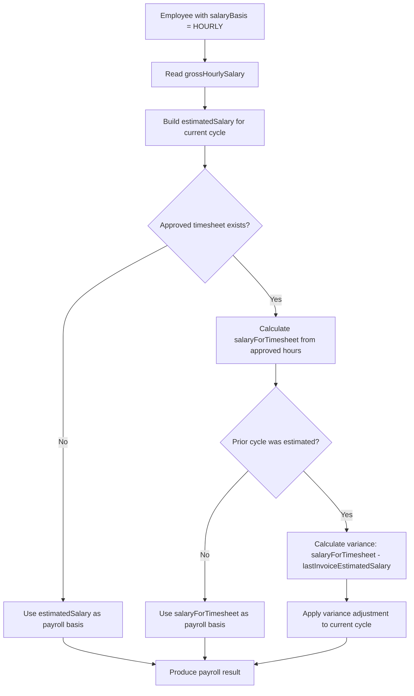

# Hourly Employees

## Overview

Hourly employees are those whose payroll is calculated from an hourly rate rather than a fixed monthly salary. The payroll process for hourly employees uses working-time assumptions to build an estimated salary for each cycle, and where approved time tracking data is available, it also calculates a timesheet-based salary. When a prior cycle used an estimate and actual hours are later confirmed, the variance is carried forward as an adjustment into the next cycle.

## Product Context

Payroll for hourly employees must be processed on time even when final timesheet data is not yet available. Playroll handles this by generating an estimated salary for the current cycle, then correcting for the difference between the estimate and actual hours in the following cycle. This means hourly employees can always be included in the monthly invoice run, with corrections applied automatically when approved timesheets arrive. Clients and operations teams need to understand that an hourly employee's invoice amount may include a correction from the previous month as well as the current month's estimated or confirmed pay.

## Core Rule

| Rule | Explanation |
|---|---|
| Hourly employees are identified by `salaryBasis = HOURLY`. | This is the primary flag that routes the employee through the hourly payroll path. |
| The payroll amount uses `grossHourlySalary` combined with working-time assumptions. | The fixed monthly salary field is not the primary input for hourly calculations. |
| When no approved timesheet exists, an estimated salary is used. | The estimate is built from expected working days or hours for the cycle. |
| When an approved timesheet exists, a timesheet-based salary is calculated. | This uses the actual approved logged hours for the period. |
| When a prior cycle used an estimate, a variance adjustment is applied in the current cycle. | The difference between the prior estimate and the actual timesheet result is added to the current cycle. |

## Hourly Processing Logic

| Step | What Happens |
|---|---|
| 1 | Identify the employee as hourly by checking `salaryBasis = HOURLY`. |
| 2 | Read the hourly rate from `grossHourlySalary`. |
| 3 | Build an estimated salary for the cycle using expected working days and hours. |
| 4 | Check whether approved time tracking data exists for the relevant period. |
| 5 | If timesheet data is available, calculate a timesheet-based salary from approved logged hours. |
| 6 | If a prior invoice used an estimate, calculate the variance between the old estimate and the confirmed timesheet result. |
| 7 | Apply the variance as an adjustment to the current cycle's payroll result. |

## Payroll Scenarios

| Scenario | Payroll Behaviour |
|---|---|
| No approved timesheet for the current period | Use `estimatedSalary` as the payroll basis. |
| Approved timesheet exists for the current period | Use `salaryForTimesheet` as the payroll basis. |
| Prior month was estimated and actual hours have arrived | Apply the variance between `lastInvoiceEstimatedSalary` and the confirmed timesheet result as a correction in the current cycle. |

## Relevant Fields

| Field | Description |
|---|---|
| `salaryBasis` | Must be `HOURLY` to route the employee through hourly payroll logic. See [[employee-data]]. |
| `grossHourlySalary` | Hourly rate used in payroll calculations. See [[employee-data]]. |
| `timeTrackingEnabled` | Indicates whether time tracking is expected for the employee. See [[employee-data]]. |
| `hourlyBasisContext.estimatedSalary` | Estimated salary generated for the current cycle. |
| `hourlyBasisContext.salaryForTimesheet` | Salary calculated from approved logged hours. |
| `hourlyBasisContext.lastInvoiceEstimatedSalary` | Prior cycle estimated salary used for variance adjustment. |
| `hourlyBasisContext.totalHoursLoggedForPreviousMonth` | Total hours logged for the previous month, used in variance calculation. |
| `timeTrackingIds` | Time tracking records linked to the invoice result. See [[calculator-results]]. |

## Diagram

## Examples

An hourly employee earns a fixed hourly rate. In Month 1, no timesheet is available, so an estimate is used. In Month 2, the actual timesheet for Month 1 arrives, and a correction is applied.

Month 1 — estimate only:

| Field | Value |
|---|---|
| `grossHourlySalary` | $25/hour |
| Expected hours | 160 |
| `estimatedSalary` | $4,000 |
| `salaryForTimesheet` | Not yet available |
| Payroll basis | $4,000 (estimate) |

Month 2 — actual timesheet arrives, correction applied:

| Field | Value |
|---|---|
| Approved hours for Month 1 | 152 |
| `salaryForTimesheet` for Month 1 | $3,800 |
| `lastInvoiceEstimatedSalary` | $4,000 |
| Variance | −$200 |
| Month 2 payroll basis | Month 2 estimated salary − $200 correction |

## Exceptions and Edge Cases

| Scenario | Behaviour | Notes |
|---|---|---|
| Hourly employee has no `grossHourlySalary` | The payroll calculation cannot proceed without an hourly rate. | This represents a data configuration issue that must be resolved before the employee can be processed. |
| Leave adjustment for hourly employees | Leave payout adjustment is disabled. The adjustment is returned as zero. | See [[leave-adjustment]]. |
| `grossMonthlySalary` on hourly employees | This field should not be interpreted as the primary salary input for hourly employees. | The relevant fields are `grossHourlySalary` and `hourlyBasisContext`. |

## Data Notes

| Observation | Note |
|---|---|
| `grossHourlySalary` can be null for non-hourly employees. | This field is only meaningful when `salaryBasis = HOURLY`. |
| `hourlyBasisContext` is optional. | It is only present on records where hourly or time-tracking logic applies. |
| `hourlyBasisContext.estimatedSalary` is optional. | Not all hourly records include an estimated salary value, depending on when the record was generated. |
| `hourlyBasisContext.salaryForTimesheet` is optional. | Only present when an approved timesheet was available for the calculation. |
| `hourlyBasisContext.lastInvoiceEstimatedSalary` is optional. | Only present when a prior estimate exists for variance calculation. |
| `timeTrackingIds` defaults to an empty array. | An empty array means no time tracking records were linked to this invoice result. |

## Source Reference

| File Path | Purpose |
|---|---|
| `packages/calculator/src/us-payroll.ts` | Contains the `isUsPayrollCountryCode` function and related US payroll configuration, including hourly rate handling for US-based employees. |
| `packages/util/src/invoice-employee-record.ts` | Defines the `hourlyBasisContext` nested object type within `EmployeeInvoiceEmployeeData`. |

> Hourly payroll uses an estimated salary when no timesheet is available, switches to actual hours when a timesheet is confirmed, and carries forward the variance between estimate and actuals into the following cycle.

## Related Pages

| Page | Purpose |
|---|---|
| [[calculator-results]] | Parent record that stores `timeTrackingIds` and the payroll result for each cycle. |
| [[employee-data]] | Documents `salaryBasis`, `grossHourlySalary`, `timeTrackingEnabled`, and `hourlyBasisContext`. |
| [[totals-breakdown]] | Documents the salary totals that reflect the hourly payroll amount for the cycle. |
| [[leave-adjustment]] | Documents the hourly employee exception where leave adjustment is disabled. |
| [[usa-pay-periods]] | Documents bi-weekly pay period logic that applies to US hourly employees. |
