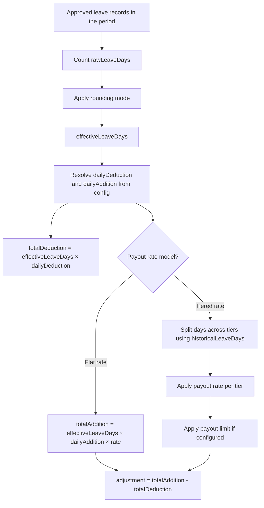

# Leave Adjustment

## Overview

A leave adjustment is the net salary impact produced when approved leave is processed in payroll for a period. The calculator counts the leave days that fall within the payroll period, converts them into an effective day count after applying rounding rules, and then calculates a deduction and an addition based on configured daily rates and payout rules. The final adjustment is the difference between the total addition and the total deduction. This object is documented in [[calculator-results]] as `leavePayoutAdjustmentContext`.

## Product Context

Leave adjustments ensure that employee pay accurately reflects approved leave during the payroll period. Different leave types can be fully paid, partially paid, or unpaid — and some organisations use tiered payout structures where the payout rate changes after a certain number of days. The leave adjustment calculation captures all of this complexity in a single net figure that flows into the payroll salary totals. Without it, an employee taking unpaid or partially paid leave would still receive full salary on the invoice.

## Core Rule

| Rule | Explanation |
|---|---|
| Only approved leave records are counted. | Pending or rejected leave does not affect the adjustment. |
| Only leave days that overlap the payroll period are included. | A leave record spanning multiple periods contributes only the portion within the current period. |
| The adjustment is `totalAddition - totalDeduction`. | A negative result means leave reduced salary. A zero result means no net impact. A positive result is possible but unusual. |
| Payout rate rules apply to `totalAddition`, not `totalDeduction`. | The deduction is always calculated at the full daily deduction rate. The addition is subject to flat or tiered payout rates and optional limits. |
| Hourly employees are excluded from this calculation. | The adjustment is returned as zero for hourly employees. See `## Exceptions and Edge Cases`. |

## Step 1: Count Raw Leave Days

The calculator first counts `rawLeaveDays` based on:

- approved leave records only
- leave type or entitlement identifier, depending on the calculation path
- overlap with the payroll period start and end dates
- working-day rules for the employee's territory
- public holidays in the employee's country
- half-day start and end settings

The raw count can be fractional. For example, half-day leave produces `0.5`.

## Step 2: Convert to Effective Leave Days

A rounding rule is applied to `rawLeaveDays` to produce `effectiveLeaveDays`.

| Rounding Mode | Result |
|---|---|
| `NONE` | Keeps the raw value unchanged. |
| `FLOOR` | Rounds down to the nearest whole number. |
| `CEILING` | Rounds up to the nearest whole number. |

Examples:

| `rawLeaveDays` | Rounding Mode | `effectiveLeaveDays` |
|---|---|---:|
| `0.5` | `FLOOR` | `0` |
| `0.5` | `CEILING` | `1` |
| `2.0` | `NONE` | `2` |

## Step 3: Resolve Daily Amounts

The leave payout configuration contains two expressions — `salaryDeduction` and `salaryAddition` — each calculated as:

`daily amount = base / divisor`

This produces `dailyDeduction` and `dailyAddition`. These values can differ, which supports unpaid, partially paid, and fully paid leave types.

| Scenario | Outcome |
|---|---|
| `dailyAddition = 0` and `dailyDeduction > 0` | Fully unpaid leave. |
| `dailyAddition = dailyDeduction` | Fully paid leave. |
| `dailyAddition < dailyDeduction` | Partially paid leave. |

## Step 4: Calculate Total Deduction

`totalDeduction = effectiveLeaveDays * dailyDeduction`

This is the gross amount removed from salary for the leave days.

## Step 5: Calculate Total Addition

`totalAddition` depends on the payout rate model in use.

### Flat payout rate

All effective leave days use the same percentage.

Example: `effectiveLeaveDays = 3`, `dailyAddition = 100`, payout rate = `50%`:

`totalAddition = 3 * 100 * 0.5 = 150`

### Tiered payout rate

Leave days are split across tiers. Each tier applies a different payout percentage.

Example tiers:

| Tier | Rule |
|---|---|
| Tier 1 | First 5 days paid at 100%. |
| Tier 2 | Thereafter paid at 50%. |

If the employee has 7 effective leave days in the current period, 5 go to Tier 1 and 2 go to Tier 2. Historical leave days consumed in earlier tiers reduce how many days fall into each tier for the current period.

## Historical Leave Days and Tier Positioning

When tiered payout is used, `historicalLeaveDays` determines where the current period's days land in the tier structure.

| Value | Amount |
|---|---:|
| Historical leave days | `5` |
| Current effective leave days | `3` |
| Tier 1 | Up to 5 days at 100%. |
| Tier 2 | Thereafter at 50%. |

Result: Tier 1 is already exhausted by history, so all 3 current days fall into Tier 2.

## Payout Limits

After the payout rate is applied, the result can be capped by a limit type.

| Limit Type | Meaning |
|---|---|
| `NONE` | No cap is applied. |
| `DAILY` | Each day's payout is capped before the total is summed. |
| `MONTHLY` | The total payout is capped after summing. |

Limits affect `totalAddition` only, not `totalDeduction`.

## Gap Reset Behaviour

Some tiered configurations use `GAP_RESET`. In this mode, tier accumulation resets whenever there is a working-day gap between leave sequences. Separate blocks of leave are treated independently for tier allocation, rather than accumulating tier history continuously across the period.

## Diagram

## Examples

An employee takes 3 days of partially paid leave in the period. The leave type is configured with a 50% payout rate and no limits.

| Field | Value |
|---|---|
| `rawLeaveDays` | `3.0` |
| Rounding mode | `NONE` |
| `effectiveLeaveDays` | `3.0` |
| `dailyDeduction` | `500` (local currency) |
| `dailyAddition` | `500` (local currency) |
| Payout rate | `50%` |
| `totalDeduction` | `1,500` |
| `totalAddition` | `750` |
| `adjustment` | `-750` |

The employee's salary is reduced by 750 for the period.

## Exceptions and Edge Cases

| Scenario | Behaviour | Notes |
|---|---|---|
| Hourly employee | The adjustment is returned as zero. `adjustment = 0`, `totalDeduction = 0`, `totalAddition = 0`. | Leave payout adjustment is disabled for hourly employees in this calculation path. See [[hourly-employee]]. |
| Partial leave overlap with payroll period | Only the days that fall within the period boundaries are counted. | A 5-day leave spanning two periods contributes only the overlapping days to each period's calculation. |
| No approved leave in the period | All fields are zero and `tierAllocations` is empty. | No adjustment is applied. |

## Data Notes

| Observation | Note |
|---|---|
| `rawLeaveDays` can be fractional. | Half-day leave flags produce `0.5` values before rounding. |
| `effectiveLeaveDays` can be zero after rounding. | A `FLOOR` rounding mode applied to `0.5` produces `0`, meaning no leave impact. |
| `adjustment` can be zero. | Fully paid leave produces a zero net adjustment because addition equals deduction. |
| `adjustment` can be positive. | Unusual, but possible if payout rate rules result in the addition exceeding the deduction. |
| `historicalLeaveDays` is only relevant for tiered payout configurations. | For flat payout configurations, this field is zero or unused. |
| `tierAllocations` is an array. | It is empty when no tiered payout configuration applies. |

## Source Reference

| File Path | Purpose |
|---|---|
| `packages/leave-calculator/src/leave-calculator.ts` | Implements the leave adjustment calculation, including day counting, rounding, daily amount resolution, payout rate models, and tier logic. |
| `packages/leave-calculator/src/types.ts` | Defines the input and output types for the leave calculator, including rounding modes, payout limit types, and tier structures. |

> Leave adjustment = total leave payout addition minus total leave deduction, calculated from approved leave days within the period after applying rounding, payout rate, and tier rules.

## Related Pages

| Page | Purpose |
|---|---|
| [[calculator-results]] | Parent record that stores `leavePayoutAdjustmentContext`. |
| [[employee-data]] | Contains `confirmedLeaveDays`, `remainingLeaveDays`, and `unpaidLeaveDeductionMultiplier` used in leave context. |
| [[totals-breakdown]] | Shows `leaveAdjustment` and `employeeLeaveDaysAmount` in the salary totals objects. |
| [[termination-results]] | Documents leave payout at termination, which uses related but distinct logic. |
| [[hourly-employee]] | Documents the hourly employee exception to leave adjustment. |
