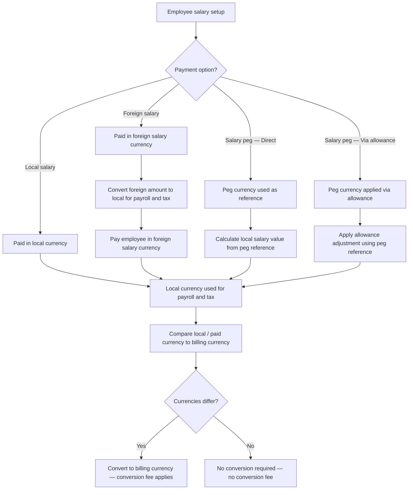

# Salary Payment Options

## Overview

Salary payment options define how an employee's salary is configured, valued, and paid. There are four payment setups: local salary, foreign salary, salary peg direct, and salary peg via allowance. The setup determines which currency the employee is actually paid in and which currency is used for local payroll and tax calculations. Detailed exchange rate fields are documented in [[exchange-rates]], conversion fee rules are documented in [[currency-conversion-fees]], and calculated totals are documented in [[totals-breakdown]].

## Product Context

Playroll supports employees in territories where salary arrangements vary significantly from the standard model. Some employees are paid in a foreign currency rather than their local territory currency. Others have salaries that are valued in a foreign reference currency but still paid locally. The salary payment option drives how payroll amounts are calculated and converted, which currencies appear in the totals breakdown, and when a conversion fee applies on the client invoice. The wrong configuration would lead to incorrect salary values, incorrect tax calculations, or incorrect invoice amounts.

## Core Rule

| Rule | Explanation |
|---|---|
| Every employee has exactly one salary payment option. | The option determines the paid currency and the payroll calculation currency for the employee. |
| Local salary employees are paid and calculated in the local currency. | The standard setup. No foreign currency involvement in payment. |
| Foreign salary employees are paid in a foreign currency but taxed in the local currency. | The foreign salary amount is converted to local currency for payroll and tax purposes. The employee is actually paid in the foreign currency. |
| Salary peg employees are paid in the local currency. | The peg currency is a reference only, used to calculate or adjust the local salary value. |
| Salary peg — direct is country-dependent. | Availability is controlled by territory rules configured by the Tax Analytics and R&D teams. |
| Salary peg — via allowance is available in all countries. | The peg is applied through an allowance mechanism rather than directly to the base salary. |

## Salary Payment Option Types

| Option | What It Means | Employee Paid In | Payroll / Tax Currency | Availability |
|---|---|---|---|---|
| Local salary | Salary is defined and paid in the employee's local currency. | Local currency | Local currency | Standard setup — available for all employees. |
| Foreign salary | Employee is actually paid in a currency other than the local currency. | Foreign salary currency | Local currency | Used when foreign salary payment is configured. |
| Salary peg — Direct | Salary value is directly linked to a foreign reference currency, but payment remains local. | Local currency | Local currency | Country-dependent. Controlled by Tax Analytics and R&D territory rules. |
| Salary peg — Via allowance | Salary value is linked to a foreign reference currency through an allowance adjustment, but payment remains local. | Local currency | Local currency | Available for all countries. |

## Salary Peg Compared to Foreign Salary

| Concept | Meaning | Employee Paid In |
|---|---|---|
| Salary peg | Foreign currency is used as a reference to value or adjust the salary. Payment remains local. | Local currency |
| Foreign salary | Foreign currency is the actual salary payment currency. | Foreign salary currency |

## Salary Peg Reference Dates

Both salary peg methods use one of three reference dates for the exchange rate applied to the peg calculation.

| Reference Date | Description | Payroll Impact |
|---|---|---|
| 5th of the month | Salary details are updated using the exchange rate on the 5th. | Included in the standard cycle if before cut-off. |
| 10th of the month | Salary details are updated using the exchange rate on the 10th. | Included in the standard cycle if before cut-off. |
| 15th of the month | Salary details are updated using the exchange rate on the 15th. | After internal cut-off — automatically treated as an [[out-of-cycle]] change. |

## Diagram

## Examples

### Local salary employee

An employee in South Africa earns a fixed monthly salary in South African Rand. Payroll, tax, and billing all use the local currency unless the billing currency differs.

| Field | Value |
|---|---|
| Payment setup | Local salary |
| Employee paid in | ZAR |
| Payroll currency | ZAR |
| `foreignSalaryCurrencyCode` | `null` |
| `peggedSalaryCurrencyCode` | `null` |

### Foreign salary employee

An employee in South Africa is paid in USD. Payroll and taxes are calculated in ZAR. The USD salary amount is converted to ZAR for payroll purposes. The employee receives payment in USD.

| Field | Value |
|---|---|
| Payment setup | Foreign salary |
| Employee paid in | USD |
| Payroll currency | ZAR |
| `foreignSalaryCurrencyCode` | `USD` |
| `foreignToLocalExchangeRate` | Exchange rate from USD to ZAR |

### Salary peg — via allowance

An employee in Nigeria has a salary pegged to USD. The local Naira salary value is adjusted each month based on the USD peg amount and the prevailing exchange rate. The employee is still paid in NGN.

| Field | Value |
|---|---|
| Payment setup | Salary peg — via allowance |
| Employee paid in | NGN |
| Payroll currency | NGN |
| `peggedSalaryCurrencyCode` | `USD` |
| `peggedSalaryType` | `ALLOWANCE` |
| `peggedToLocalExchangeRate` | Exchange rate from USD to NGN |

## Exceptions and Edge Cases

| Scenario | Behaviour | Notes |
|---|---|---|
| Salary peg — Direct not available for the employee's territory | The direct peg option is unavailable. Only via-allowance pegging may be used. | Direct peg availability is controlled by territory rules. |
| Peg reference date falls after internal cut-off | The salary update is treated as an out-of-cycle change. | The 15th reference date automatically routes through [[out-of-cycle]] processing. |
| Foreign salary currency equals the billing currency | No conversion fee applies to the salary component. | The paid currency and billing currency are the same, so no conversion is needed. |

## Data Notes

| Observation | Note |
|---|---|
| `foreignSalaryCurrencyCode` is null for non-foreign-salary employees. | Only populated when the employee has a foreign salary payment setup. |
| `foreignSalaryAmount` is null for non-foreign-salary employees. | Only populated when a foreign salary amount is configured. |
| `peggedSalaryCurrencyCode` is null for non-pegged employees. | Only populated when a salary peg is configured. |
| `peggedSalaryType` is null for non-pegged employees. | Values are `DIRECT` or `ALLOWANCE` when populated. |
| `peggedSalaryAdjustmentEnabled` can be null. | Indicates whether peg adjustment logic is currently active for the employee. |
| `peggedSalaryAdjustmentDay` can be null. | Only populated when a specific adjustment day is configured for the peg. |

## Source Reference

| File Path | Purpose |
|---|---|
| `packages/util/src/invoice-employee-record.ts` | Defines `EmployeeInvoiceExchangeRateContext`, which contains all salary payment currency fields including `foreignSalaryCurrencyCode`, `peggedSalaryType`, and related exchange rate fields. |
| `prisma/schema.prisma` | Defines the `EmployeePeggedSalaryType` enum with values `DIRECT` and `ALLOWANCE`. |

> The salary payment option determines the currency in which the employee is actually paid and the currency used for local payroll and tax calculations; a conversion fee applies on any component where the paid or funded currency differs from the client billing currency.

## Related Pages

| Page | Purpose |
|---|---|
| [[exchange-rates]] | Documents the exchange rate context fields for foreign salary and salary peg arrangements. |
| [[currency-conversion-fees]] | Documents when and how conversion fees apply based on the salary payment setup. |
| [[totals-breakdown]] | Documents the final salary and invoice totals across local, payment, and billing currencies. |
| [[out-of-cycle]] | Documents salary updates processed outside the standard payroll cycle, including peg changes after cut-off. |
| [[employee-allowances]] | Documents the allowance structure used for via-allowance salary peg adjustments. |
| [[calculator-results]] | Parent record containing the exchange rate context and salary totals. |
