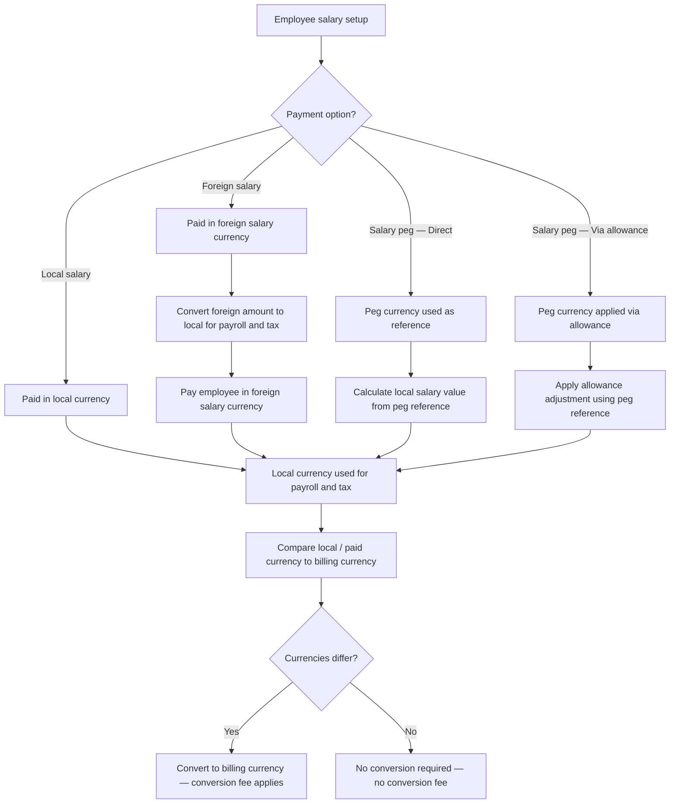

# Salary Payment Options

## Overview

Salary payment options define how an employee's salary is configured, valued, and paid. There are four payment setups: local salary, foreign salary, salary peg direct, and salary peg via allowance. The setup determines which currency the employee is actually paid in and which currency is used for local payroll and tax calculations. Detailed exchange rate fields are documented in [[exchange-rates]], conversion fee rules are documented in [[currency-conversion-fees]], and calculated totals are documented in [[totals-breakdown]].

**Search Tags:** `salary payment options`, `salary payment option`, `foreign salary`, `salary peg`, `salary-peg`, `pegged salary`, `foreignSalaryCurrencyCode`, `peggedSalaryType`

## Product Context

Playroll supports employees in territories where salary arrangements vary significantly from the standard model. Some employees are paid in a foreign currency rather than their local territory currency. Others have salaries that are valued in a foreign reference currency but still paid locally. The salary payment option drives how payroll amounts are calculated and converted, which currencies appear in the totals breakdown, and when a conversion fee applies on the client invoice. The wrong configuration would lead to incorrect salary values, incorrect tax calculations, or incorrect invoice amounts.

## Core Rule

| Rule | Explanation |
|---|---|
| Every employee has exactly one salary payment option. | The option determines the paid currency and the payroll calculation currency for the employee. |
| Local salary employees are paid and calculated in the local currency. | The standard setup. No foreign currency involvement in payment. |
| Foreign salary employees are paid in a foreign currency but taxed in the local currency. | The foreign salary amount is converted to local currency for payroll and tax purposes. The employee is actually paid in the foreign currency. |
| Salary peg employees are paid in the local currency. | The peg currency is a reference only, used to calculate or adjust the local salary value. |
| Salary peg — direct is country-dependent. | Availability is controlled by territory rules configured by the Tax Analytics and R&D teams. |
| Salary peg — via allowance is available in all countries. | The peg is applied through an allowance mechanism rather than directly to the base salary. |

## Salary Payment Option Types

| Option | What It Means | Employee Paid In | Payroll / Tax Currency | Availability |
|---|---|---|---|---|
| Local salary | Salary is defined and paid in the employee's local currency. | Local currency | Local currency | Standard setup — available for all employees. |
| Foreign salary | Employee is actually paid in a currency other than the local currency. | Foreign salary currency | Local currency | Used when foreign salary payment is configured. |
| Salary peg — Direct | Salary value is directly linked to a foreign reference currency, but payment remains local. | Local currency | Local currency | Country-dependent. Controlled by Tax Analytics and R&D territory rules. |
| Salary peg — Via allowance | Salary value is linked to a foreign reference currency through an allowance adjustment, but payment remains local. | Local currency | Local currency | Available for all countries. |

## Salary Definition Currency vs Salary Payment Currency

These concepts are closely related but not identical.

| Concept | Meaning |
|---|---|
| Salary definition currency | The currency used to define or reference the employee's salary arrangement. |
| Salary payment currency | The currency in which the employee is actually paid. |
| Local payroll currency | The territory currency used for payroll and tax calculations. |

How this applies by setup:

| Option | Salary Definition Currency | Salary Payment Currency | Local Payroll Currency |
|---|---|---|---|
| Local salary | Local currency | Local currency | Local currency |
| Foreign salary | Foreign salary currency | Foreign salary currency | Local currency |
| Salary peg — Direct | Peg currency is the reference for the salary value | Local currency | Local currency |
| Salary peg — Via allowance | Peg currency is the reference for the adjustment amount | Local currency | Local currency |

## Salary Peg Compared to Foreign Salary

| Concept | Meaning | Employee Paid In |
|---|---|---|
| Salary peg | Foreign currency is used as a reference to value or adjust the salary. Payment remains local. | Local currency |
| Foreign salary | Foreign currency is the actual salary payment currency. | Foreign salary currency |

## Salary Peg Reference Dates

Both salary peg methods use one of three reference dates for the exchange rate applied to the peg calculation.

| Reference Date | Description | Payroll Impact |
|---|---|---|
| 5th of the month | Salary details are updated using the exchange rate on the 5th. | Included in the standard cycle if before cut-off. |
| 10th of the month | Salary details are updated using the exchange rate on the 10th. | Included in the standard cycle if before cut-off. |
| 15th of the month | Salary details are updated using the exchange rate on the 15th. | After internal cut-off — automatically treated as an [[out-of-cycle]] change. |

## Diagram

## Examples

### Local salary employee

An employee in South Africa earns a fixed monthly salary in South African Rand. Payroll, tax, and billing all use the local currency unless the billing currency differs.

| Field | Value |
|---|---|
| Payment setup | Local salary |
| Employee paid in | ZAR |
| Payroll currency | ZAR |
| `foreignSalaryCurrencyCode` | `null` |
| `peggedSalaryCurrencyCode` | `null` |

### Foreign salary employee

An employee in South Africa is paid in USD. Payroll and taxes are calculated in ZAR. The USD salary amount is converted to ZAR for payroll purposes. The employee receives payment in USD.

| Field | Value |
|---|---|
| Payment setup | Foreign salary |
| Employee paid in | USD |
| Payroll currency | ZAR |
| `foreignSalaryCurrencyCode` | `USD` |
| `foreignToLocalExchangeRate` | Exchange rate from USD to ZAR |

### Salary peg — via allowance

An employee in Nigeria has a salary pegged to USD. The local Naira salary value is adjusted each month based on the USD peg amount and the prevailing exchange rate. The employee is still paid in NGN.

| Field | Value |
|---|---|
| Payment setup | Salary peg — via allowance |
| Employee paid in | NGN |
| Payroll currency | NGN |
| `peggedSalaryCurrencyCode` | `USD` |
| `peggedSalaryType` | `ALLOWANCE` |
| `peggedToLocalExchangeRate` | Exchange rate from USD to NGN |

## Relationship to Salary Basis and Hourly Employees

Salary payment setup and salary basis are separate decisions.

| Concept | What It Answers |
|---|---|
| Salary payment option | Which currency model applies to the employee? |
| Salary basis | Is the employee paid on a monthly or hourly basis? |

This means an employee can be:

- monthly with local salary
- monthly with foreign salary
- monthly with salary peg
- hourly with local salary
- hourly with foreign salary
- hourly with salary peg, if the territory and product rules allow it

The code treats `salaryBasis` and salary-payment fields as separate parts of the employee snapshot:

| Employee Data Field | Purpose |
|---|---|
| `salaryBasis` | Routes the employee through monthly or hourly payroll logic. |
| `grossMonthlySalary` | Main monthly salary input when `salaryBasis = MONTHLY`. |
| `grossHourlySalary` | Main hourly-rate input when `salaryBasis = HOURLY`. |
| `hourlyBasisContext.*` | Holds estimate, timesheet, and variance-adjustment values for hourly payroll. |
| `foreignSalaryCurrencyCode` / `foreignSalaryAmount` | Captures foreign salary setup where applicable. |
| `peggedSalaryCurrencyCode` / `peggedSalaryType` / `peggedSalaryAmount` | Captures salary peg setup where applicable. |

Practical implication:

- salary basis decides how gross pay is calculated
- salary payment setup decides how that pay is represented, converted, and billed across currencies

For hourly employees, the estimate or timesheet-derived pay still flows into the same exchange-rate and totals structures documented in [[exchange-rates]] and [[totals-breakdown]]. The difference is only the way the gross salary input is produced. See [[hourly-employee]].

## Relationship to Calculator Outputs

The salary payment option does not live only on the employee profile. It is persisted into the calculator result so each result remains auditable even if the employee setup changes later.

Main links to the calculator result:

| Result Field | What It Stores |
|---|---|
| `employeeData.salaryBasis` | Monthly vs hourly calculation path used for the result. |
| `exchangeRateContext.foreignSalaryCurrencyCode` | Foreign salary payment currency, where applicable. |
| `exchangeRateContext.foreignSalaryAmount` | Foreign salary amount, where applicable. |
| `exchangeRateContext.foreignToLocalExchangeRate` | Exchange rate used to convert foreign salary to local payroll currency. |
| `exchangeRateContext.peggedSalaryCurrencyCode` | Peg reference currency, where applicable. |
| `exchangeRateContext.peggedSalaryType` | `DIRECT` or `ALLOWANCE`. |
| `exchangeRateContext.peggedSalaryAmount` | Peg reference amount. |
| `exchangeRateContext.peggedToLocalExchangeRate` | Exchange rate used for peg conversion to local value. |
| `totalsSalaryPaymentCurrency` | Salary totals in a salary-payment-facing representation when the result includes one. |

## Downstream Representation Nuance

Not every non-local arrangement behaves the same way in downstream totals and reporting.

| Arrangement | Important Nuance |
|---|---|
| Foreign salary | The employee is actually paid in a foreign currency, so salary-payment-currency totals are a natural representation. |
| Salary peg — Direct | The salary is still paid locally, but code paths may still create a salary-payment-style representation using the peg/reference side of the arrangement. |
| Salary peg — Via allowance | The peg is implemented through an allowance adjustment, so downstream salary-payment-currency representations are not always treated the same way as direct peg or foreign salary. |

This matters because some downstream code paths detect "foreign or pegged currency" using:

- `foreignToLocalExchangeRate !== null`
- or `peggedSalaryType === DIRECT`

That means direct peg and foreign salary are often grouped together operationally, while peg-via-allowance can behave differently in reporting and derived totals.

## Relationship to Cost Calculator and Reporting

The salary payment option affects more than the employee's base pay. It also changes how calculator and reporting code values related components.

| Area | Effect |
|---|---|
| Gross salary conversion | Foreign salary and peg arrangements require exchange-rate context to derive the local payroll value or billing value. |
| Other costs / allowances | Reporting code can convert allowance totals using salary-definition-to-salary-payment exchange rates. |
| Termination payouts | Termination results can include salary-payment-currency amounts when foreign salary or direct peg logic applies. |
| Invoice totals | Billing-currency totals and conversion fee behaviour depend on the relationship between local, salary payment, and billing currencies. |

For hourly employees specifically:

- the cost calculator first derives the gross pay from hourly logic
- then the same salary-payment and exchange-rate model is applied to represent that result across currencies

So the relationship is:

`salary basis -> gross pay calculation path`

then

`salary payment option -> currency representation and billing path`

## Exceptions and Edge Cases

| Scenario | Behaviour | Notes |
|---|---|---|
| Salary peg — Direct not available for the employee's territory | The direct peg option is unavailable. Only via-allowance pegging may be used. | Direct peg availability is controlled by territory rules. |
| Peg reference date falls after internal cut-off | The salary update is treated as an out-of-cycle change. | The 15th reference date automatically routes through [[out-of-cycle]] processing. |
| Foreign salary currency equals the billing currency | No conversion fee applies to the salary component. | The paid currency and billing currency are the same, so no conversion is needed. |

## Data Notes

| Observation | Note |
|---|---|
| `foreignSalaryCurrencyCode` is null for non-foreign-salary employees. | Only populated when the employee has a foreign salary payment setup. |
| `foreignSalaryAmount` is null for non-foreign-salary employees. | Only populated when a foreign salary amount is configured. |
| `peggedSalaryCurrencyCode` is null for non-pegged employees. | Only populated when a salary peg is configured. |
| `peggedSalaryType` is null for non-pegged employees. | Values are `DIRECT` or `ALLOWANCE` when populated. |
| `peggedSalaryAdjustmentEnabled` can be null. | Indicates whether peg adjustment logic is currently active for the employee. |
| `peggedSalaryAdjustmentDay` can be null. | Only populated when a specific adjustment day is configured for the peg. |
| Hourly employees can still carry salary-payment fields. | `salaryBasis = HOURLY` does not prevent foreign salary or peg-related fields from being captured. |
| `totalsSalaryPaymentCurrency` should not be assumed for every peg mode. | Direct peg and foreign salary are more consistently represented downstream than peg-via-allowance. |

## Source Reference

| File Path | Purpose |
|---|---|
| `packages/util/src/invoice-employee-record.ts` | Defines `EmployeeInvoiceExchangeRateContext`, which contains all salary payment currency fields including `foreignSalaryCurrencyCode`, `peggedSalaryType`, and related exchange rate fields. |
| `packages/invoice-service/src/helpers.ts` | Builds `employeeData`, `exchangeRateContext`, and the salary-payment-currency totals persisted on the calculator result. |
| `packages/calculator/src/engine/engine.ts` | Shows how salary payment currency is resolved in the calculator engine alongside local currency. |
| `packages/calculator/src/engine/estimation.ts` | Shows that hourly gross pay is estimated separately before flowing into the same broader currency model. |
| `services/cron-service/lib/services/PeggedSalary.service.ts` | Shows how peg amounts are converted to local values and how via-allowance peg updates are generated. |
| `prisma/schema.prisma` | Defines the `EmployeePeggedSalaryType` enum with values `DIRECT` and `ALLOWANCE`. |

> The salary payment option determines the currency in which the employee is actually paid and the currency used for local payroll and tax calculations; a conversion fee applies on any component where the paid or funded currency differs from the client billing currency.

## Related Pages

| Page | Purpose |
|---|---|
| [[exchange-rates]] | Documents the exchange rate context fields for foreign salary and salary peg arrangements. |
| [[currency-conversion-fees]] | Documents when and how conversion fees apply based on the salary payment setup. |
| [[totals-breakdown]] | Documents the final salary and invoice totals across local, payment, and billing currencies. |
| [[out-of-cycle]] | Documents salary updates processed outside the standard payroll cycle, including peg changes after cut-off. |
| [[employee-allowances]] | Documents the allowance structure used for via-allowance salary peg adjustments. |
| [[calculator-results]] | Parent record containing the exchange rate context and salary totals. |
| [[hourly-employee]] | Documents the hourly gross-pay path that can feed the same salary-payment and exchange-rate model. |
| [[salary-basis]] | Documents the separate `salaryBasis` decision that determines monthly vs hourly payroll logic. |
