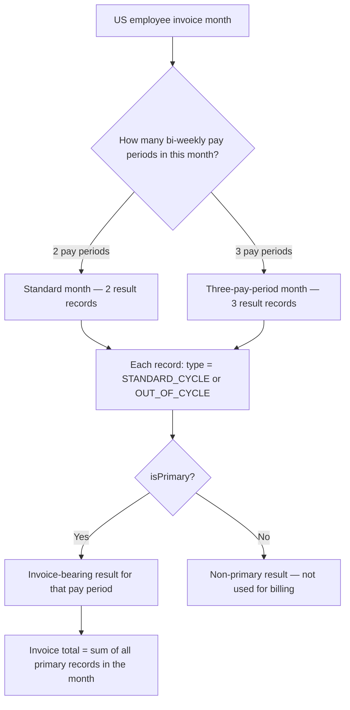

# USA Pay Periods

## Overview

US employees are paid bi-weekly, meaning they are paid once every two weeks for a total of 26 pay periods per year. Because Playroll invoices clients on a monthly basis across 12 calendar months, the 26 bi-weekly pay periods do not divide evenly into 12 months. This mismatch means that most months contain 2 pay periods, but approximately 2 months per year contain 3 pay periods. Invoice totals for US employees vary month to month as a direct result of this structure.

## Product Context

Clients with US employees need to understand that invoice amounts will be higher in months that contain 3 pay periods, even when the employee's pay has not changed. This is not an error — it reflects the additional pay cycle within that month. The bi-weekly structure also means that invoice results are generated and tracked at the pay-period level, not the monthly level, to ensure accurate per-cycle reporting. Payroll operations teams use the pay period fields on each result record to identify which cycle a record belongs to and whether it is the primary invoice-facing result.

## Core Rule

| Rule | Explanation |
|---|---|
| US employees have 26 bi-weekly pay periods per year. | 52 weeks divided by 2 weeks per period equals 26 periods. |
| Invoicing is monthly across 12 calendar months. | 26 pay periods do not divide evenly into 12 months. |
| Most months contain 2 pay periods. | 10 months per year have 2 pay periods. |
| Approximately 2 months per year contain 3 pay periods. | These months produce a higher invoice because the employee is paid for an additional cycle. |
| The invoice-bearing result for a US employee is the record where `type` is `STANDARD_CYCLE` or `OUT_OF_CYCLE` and `isPrimary` is `true`. | Multiple records may exist for the same employee and month; `isPrimary` identifies the billable one. |

## Pay Period Structure

| Month Type | Number of Pay Periods | Frequency |
|---|---:|---:|
| Standard month | 2 | 10 months per year |
| Three-pay-period month | 3 | 2 months per year |

## Simple Example

If a US employee earns a fixed amount per bi-weekly pay period:

| Pay Period Amount | Month Type | Monthly Invoice Salary Amount |
|---|---|---|
| $2,000 | 2-pay-period month | $4,000 |
| $2,000 | 3-pay-period month | $6,000 |

The employee's pay did not change. The invoice is higher because the month contains one additional pay period.

## Relevant Invoice Result Fields

| Field | Why It Matters |
|---|---|
| `payPeriodStart` | Shows when the bi-weekly pay period begins. |
| `payPeriodEnd` | Shows when the bi-weekly pay period ends. |
| `calculationPeriod` | Identifies the result as `BI_WEEKLY` rather than `MONTHLY`. |
| `isAggregated` | Indicates whether multiple pay period results have been rolled into a monthly invoice result. |
| `isPrimary` | Identifies the main invoice-facing result where multiple records exist for the same period. |
| `invoiceDate` | Shows the invoice month the pay period result belongs to. |

All fields above are documented in [[calculator-results]].

## Invoice Interpretation for US Employees

For US employees, Playroll bases invoice totals on the per-pay-period result where `type` is `STANDARD_CYCLE` or `OUT_OF_CYCLE` and `isPrimary` is `true`. Each pay period is displayed as a separate line on the invoice breakdown to ensure clarity on the per-cycle amounts.

## Diagram

## Exceptions and Edge Cases

| Scenario | Behaviour | Notes |
|---|---|---|
| New starter joins mid-cycle | A prorated result may be generated for the partial pay period. | The pay period fields identify the specific period, and proration fields show the days worked. |
| Employee is terminated during a pay period | A termination result is included in the final pay period record. | See [[termination-results]]. |
| `isAggregated` is `true` | Multiple bi-weekly pay period results have been combined into a single aggregated monthly record. | This is used in specific aggregation scenarios and affects how records are read for reporting. |

## Data Notes

| Observation | Note |
|---|---|
| `payPeriodStart` and `payPeriodEnd` are null for monthly employees. | These fields are only populated for bi-weekly (`BI_WEEKLY`) pay period records. |
| `calculationPeriod` defaults to `MONTHLY`. | US bi-weekly employees will have `BI_WEEKLY` explicitly set. |
| Multiple records can exist for the same employee and invoice month. | One record per pay period within the month, plus potentially an aggregated record. |
| `isPrimary` is `false` by default. | Only the designated primary record for each pay period is the invoice-facing result. |

## Source Reference

| File Path | Purpose |
|---|---|
| `packages/calculator/src/us-payroll.ts` | Implements the US bi-weekly payroll logic, including pay period identification and the 26-period-per-year constant. |
| `prisma/schema.prisma` | Defines `InvoiceEmployeeRecordCalculationPeriod` with values `MONTHLY` and `BI_WEEKLY`, and the `payPeriodStart`, `payPeriodEnd`, `isAggregated`, and `isPrimary` fields on the `InvoiceEmployeeRecord` model. |

> US bi-weekly payroll produces 26 pay periods per year, causing some invoice months to contain 3 pay periods and a correspondingly higher invoice total.

## Related Pages

| Page | Purpose |
|---|---|
| [[calculator-results]] | Documents all invoice result fields including pay period dates, `calculationPeriod`, `isAggregated`, and `isPrimary`. |
| [[invoice-record-type]] | Documents the `type` values used to identify standard, out-of-cycle, and upcoming cycle records. |
| [[totals-breakdown]] | Documents the salary totals structure that appears on each pay period result. |
| [[termination-results]] | Documents termination payout handling for US employees during final pay periods. |
| [[out-of-cycle]] | Documents out-of-cycle adjustments that can occur within a bi-weekly payroll schedule. |
